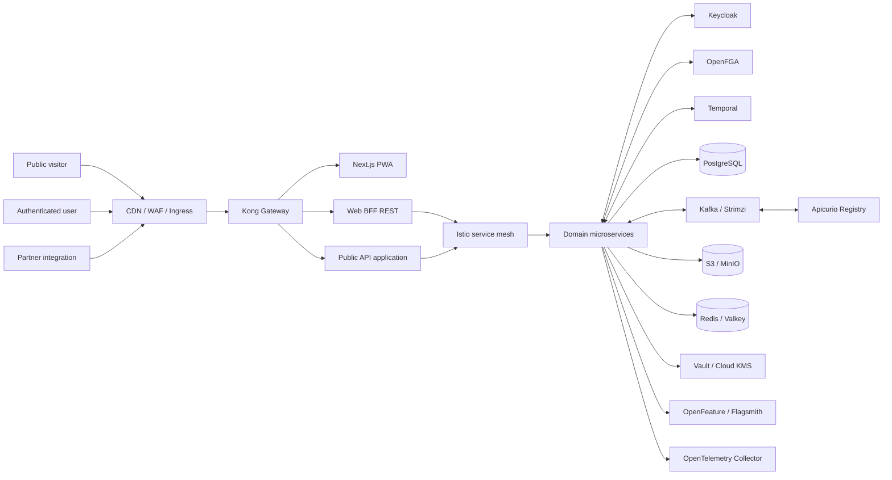
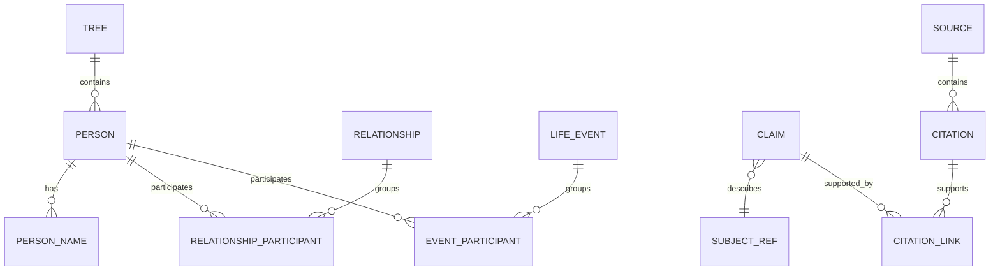
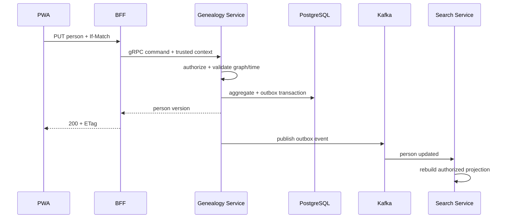

# Genealogy Platform — Design

## 1. Trạng thái tài liệu

Thiết kế ban đầu dựa trên các quyết định đã được chốt:

| Chủ đề | Quyết định |
|---|---|
| Sản phẩm | SaaS đa tenant + Enterprise on-premise |
| Phạm vi | Bản đầy đủ, gồm DNA |
| Client | Web responsive/PWA |
| Frontend | Next.js + TypeScript, Tailwind CSS + shadcn/ui |
| Backend | Java 21 + Spring Boot |
| Kiến trúc | Microservices |
| API ngoài | BFF REST + OpenAPI |
| Nội bộ | gRPC + Kafka |
| Dữ liệu | PostgreSQL trước, `tenant_id`, ownership theo service |
| Media | S3-compatible + asynchronous workers |
| Auth | Keycloak qua chuẩn OIDC |
| Repository | Monorepo: pnpm + Turborepo + Gradle |
| Runtime | Docker/OCI, Kubernetes + Helm |
| Observability | OpenTelemetry, Prometheus/Grafana/Loki/Tempo |
| Cộng tác | Direct edit hoặc approval, cấu hình theo policy |
| Quốc tế hóa | Toàn cầu, đa ngôn ngữ/đa lịch/RTL |
| API gateway | Kong Gateway, phạm vi gateway runtime |
| Identity | Keycloak |
| Workflow/Saga | Temporal |
| Authorization | OpenFGA + ABAC trong ứng dụng |
| Event platform | Kafka bằng Strimzi + Apicurio Registry |
| Object storage | S3 managed cho SaaS + MinIO cho on-premise |
| Secrets/KMS | HashiCorp Vault + cloud KMS |
| Service mesh | Istio |
| GitOps | Argo CD + Argo Rollouts |
| Data access | jOOQ + Flyway |
| Cache | Redis/Valkey-compatible |
| Feature flags | OpenFeature + Flagsmith |
| Media processing | ClamAV, FFmpeg, libvips/ImageMagick, Tika, Tesseract, Gotenberg |
| Delivery adapters | Email/provider adapters; SMTP cho on-premise |
| Security CI | Semgrep, Trivy, Syft/Grype, Gitleaks, ZAP, Checkov, Cosign, Renovate |

Các phiên bản và công nghệ còn mở không được coi là quyết định cuối. Mục 16 liệt kê các ADR còn lại.

## 2. Nguyên tắc thiết kế

1. Privacy by default; policy được áp dụng trước truy vấn và trước serialization.
2. Service sở hữu dữ liệu; không chia sẻ bảng và không join xuyên service.
3. API contract-first: OpenAPI cho REST, Protobuf cho gRPC, schema versioned cho Kafka.
4. Strong consistency trong aggregate; eventual consistency giữa service.
5. Person không đồng nhất với User.
6. Provenance, certainty, consent và audit là dữ liệu hạng nhất.
7. Cloud/on-premise parity thông qua adapter và cấu hình, không fork code sản phẩm.
8. Tối ưu vận hành bằng số service vừa đủ; không tách service chỉ theo entity CRUD.

## 3. Bối cảnh hệ thống



### 3.1 Build versus buy/reuse

Nền tảng chỉ tự xây domain service, BFF composition và public API resource model. Các capability phổ biến được giao cho công cụ chuẩn:

| Capability | Công cụ chịu trách nhiệm | Phần ứng dụng còn phải làm |
|---|---|---|
| Edge API traffic | Kong Gateway | Khai báo route/plugin, domain authorization trong service |
| Login/MFA/federation | Keycloak | Membership mapping, tenant policy, Person linking |
| Relationship authorization | OpenFGA | Tuple lifecycle; ABAC cho living/DNA/consent |
| Durable workflow/saga | Temporal | Workflow/activity nghiệp vụ và compensation |
| Event runtime/schema | Strimzi Kafka + Apicurio | Event contract, outbox, consumer idempotency |
| Service mTLS/traffic | Istio | Deadline và domain failure handling |
| Object storage | S3/MinIO | Asset metadata, authorization và lifecycle nghiệp vụ |
| Secret/key management | Vault/cloud KMS | Key classification và rotation workflow |
| Feature rollout | OpenFeature/Flagsmith | Flag taxonomy và safe fallback |
| GitOps/progressive delivery | Argo CD/Rollouts | Manifest/Helm, health metric và promotion policy |
| Media tooling | ClamAV/FFmpeg/libvips/Tika/Tesseract/Gotenberg | Pipeline orchestration, sandbox và metadata |
| Observability | Grafana OSS stack | Instrumentation, SLI/SLO và redaction |

Không xây API gateway service, identity credential store, generic workflow engine, relationship authorization database, schema registry, feature-flag system hoặc observability backend riêng.

## 4. Phân ranh giới dịch vụ

Khởi đầu với 11 deployable domain service và hạ tầng dùng chung. Chỉ tách thêm khi có nhu cầu scale, ownership hoặc isolation rõ ràng.

| Service | Trách nhiệm | Aggregate/data sở hữu |
|---|---|---|
| `tenant-service` | Tenant, membership, invitations, role/policy, plan/quota, feature flag | Tenant, Membership, Invitation, Entitlement |
| `genealogy-service` | Tree, Person, family relationship, event, claims, merge, version | Tree, Person, Relationship, LifeEvent, Claim |
| `research-service` | Source, citation, repository, research log, task, hypothesis | Source, Citation, ResearchTask |
| `collaboration-service` | Proposal, review, comment, mention, watch, activity | ChangeProposal, Review, Comment |
| `media-service` | Upload session, object metadata, album, processing, delivery | MediaAsset, MediaVariant, Album |
| `search-service` | Authorized search projection, public index projection, saved search | SearchDocument, SavedSearch |
| `import-export-service` | GEDCOM/CSV/JSON/PDF jobs, mapping, validation, bundle | TransferJob, MappingProfile, ExportManifest |
| `dna-service` | Kit, consent, encrypted raw object reference, match/segment | DnaKit, Consent, DnaMatch, Segment |
| `notification-service` | Preference, template, in-app/email/push adapters | Notification, Preference, Template |
| `reporting-service` | Dashboard/read models, publication and report jobs | ReportJob, ReportTemplate, AnalyticsProjection |
| `audit-service` | Append-only security/business audit, export and retention | AuditEntry, AuditExport |

### 4.1 Thành phần edge

- `Kong Gateway`: route, TLS policy, OIDC/JWT validation, CORS, request-size limit, rate limit, correlation ID và coarse traffic policy. Kong không chứa authorization nghiệp vụ hoặc aggregate data.
- `web-app`: Next.js PWA, SSR/streaming cho public page và authenticated shell.
- `web-bff`: Spring Boot REST API tối ưu cho màn hình và orchestration UI; không sở hữu domain data và không thay vai trò Kong.
- `public-api`: ứng dụng REST/OpenAPI versioned cung cấp resource/contract, idempotency và webhook management; traffic/runtime policy do Kong đảm nhiệm.
- Developer portal, API product/subscription và monetization chưa thuộc phạm vi Kong runtime; chỉ bổ sung qua ADR nếu nhu cầu partner chứng minh cần thiết.

### 4.2 Identity và authorization platform

Keycloak quản lý credential, login, MFA, recovery và federation. `tenant-service` ánh xạ Keycloak subject sang membership và đồng bộ quan hệ quyền vào OpenFGA. Không lưu password trong platform.

OpenFGA quản lý relationship-based access như user–tenant, user–tree, group–role và branch scope. ABAC trong domain service bắt buộc cho living/minor status, resource classification, consent purpose, jurisdiction và contextual deny. OpenFGA không thay thế tenant predicate/RLS, và kết quả `allow` vẫn phải qua ABAC/redaction.

## 5. Mô hình dữ liệu

### 5.1 PostgreSQL ownership

- Một PostgreSQL cluster có thể phục vụ nhiều service ban đầu nhưng mỗi service dùng database hoặc schema + role riêng.
- Migration riêng theo service; credential không cho phép đọc schema khác.
- Tất cả bảng tenant-scoped có `tenant_id`, khóa chính opaque, timestamps và version.
- PostgreSQL Row-Level Security được dùng như lớp defense-in-depth; application authorization vẫn bắt buộc.
- Connection pool có giới hạn để tránh số service làm cạn kết nối.

### 5.2 Mô hình phả hệ khái niệm



`RELATIONSHIP` + participant/role được ưu tiên thay vì chỉ `father_id`/`mother_id`, nhằm hỗ trợ nhiều phụ huynh, nhận nuôi, giám hộ và uncertainty. Các đường dẫn tổ tiên/hậu duệ được tính từ relationship đã được policy cho phép.

### 5.3 Temporal, certainty và calendar

- Ngày lưu normalized interval để sort/query và original expression để tái hiển thị.
- Calendar identifier, precision, qualifier (`ABOUT`, `BEFORE`, `AFTER`, `BETWEEN`) và timezone được giữ riêng.
- Claim/relationship có confidence, status (`HYPOTHESIS`, `ASSERTED`, `VERIFIED`, `DISPUTED`) và provenance.

### 5.4 Tree projection

`genealogy-service` duy trì read model cho neighborhood/subtree theo root, direction, depth và relationship filters. Cache chỉ là tối ưu; source of truth vẫn là aggregate tables. Projection mang version để client nhận biết stale data.

### 5.5 Dữ liệu DNA

- Metadata và consent nằm trong database riêng của `dna-service`.
- Raw DNA nằm ở bucket/prefix riêng, encryption key riêng và không được media service render.
- Khóa dữ liệu dùng envelope encryption; quyền giải mã chỉ cấp cho workload DNA.
- Consent được model theo purpose, action, subject, guardian, jurisdiction, policy version, effective/expiry/revoked time.
- Match computation chạy worker cô lập; output không chứa raw genotype ngoài nhu cầu tối thiểu.

## 6. Multi-tenancy và authorization

### 6.1 Trusted tenant context

1. BFF xác thực access token với issuer/audience/JWKS.
2. Tenant được chọn từ route/header có kiểm soát và được đối chiếu membership từ authoritative service/cache ký số.
3. BFF truyền signed service identity + user/tenant context qua gRPC metadata.
4. Service xác thực mTLS/service token và tự kiểm quyền domain; không tin metadata từ public ingress.
5. Repository bắt buộc tenant predicate; RLS chặn truy cập khác tenant.

### 6.2 Policy model

RBAC cung cấp vai trò nền; ABAC bổ sung điều kiện:

- tenant/tree/branch/resource scope;
- living/minor status;
- privacy classification;
- relationship với subject;
- consent purpose;
- direct-edit/approval mode;
- time-bound guest/support access.

Policy decision có `allow/deny`, obligations (redact, watermark, audit) và reason code. Cache policy phải invalidation khi role/policy/consent đổi.

### 6.3 Visibility

- `PRIVATE`: không có public projection.
- `UNLISTED`: token/mã truy cập hash, expiry, scope, rate limit; trả `noindex`.
- `PUBLIC`: dùng public projection đã redaction, không truy vấn bản ghi private trực tiếp cho anonymous user.

## 7. API và giao tiếp

### 7.1 REST ngoài hệ thống

- URI versioned `/api/v1/...`, JSON, RFC 9457 Problem Details.
- OpenAPI là source contract; generated client/types phải được kiểm diff compatibility.
- Cursor pagination, ETag/If-Match cho concurrency, idempotency key cho mutation quan trọng.
- BFF response theo use case, tránh proxy 1:1 mọi endpoint service.

### 7.2 gRPC nội bộ

- Protobuf package/version rõ ràng, field không tái sử dụng, backward compatibility trong CI.
- Deadline bắt buộc; retry chỉ cho operation idempotent; giới hạn message size.
- Không tạo chuỗi synchronous dài; tối đa hóa composition ở BFF/read model.

### 7.3 Kafka eventing

Event envelope tối thiểu:

```json
{
  "eventId": "opaque-id",
  "eventType": "genealogy.person.v1.updated",
  "occurredAt": "RFC-3339",
  "tenantId": "opaque-id",
  "aggregateId": "opaque-id",
  "aggregateVersion": 7,
  "traceId": "opaque-id",
  "payload": {}
}
```

- Transactional outbox → relay → Kafka.
- Partition key là aggregate ID hoặc tenant + aggregate tùy ordering requirement.
- Consumer inbox/idempotency; retry topic và dead-letter có quy trình replay.
- Không đưa raw DNA, file content, access token hoặc PII không cần thiết vào event.
- Event schema có compatibility policy; xóa field qua version mới, không phá consumer.

### 7.4 Temporal workflow và saga

Workflow liên service như xóa tenant, import/export bundle, media processing, publish tree và consent revocation chạy trên Temporal. Workflow code phải deterministic; activity có timeout/retry policy, idempotency key và heartbeat cho tác vụ dài. Search attributes không chứa PII nhạy cảm. Temporal lưu orchestration state, còn domain service vẫn là source of truth. Không tự xây generic job-state/retry scheduler và không dùng distributed transaction.

## 8. Luồng chính

### 8.1 Tạo/cập nhật person



### 8.2 Upload media

1. BFF yêu cầu media service tạo upload session sau quota/permission check.
2. Client upload multipart trực tiếp S3 bằng signed URL.
3. Client finalize bằng checksum; media ở trạng thái `QUARANTINED`.
4. Worker kiểm MIME, malware, metadata; tạo variant/OCR/transcode.
5. Chỉ asset `READY` mới được liên kết/xem; lỗi chuyển `REJECTED` và audit.

### 8.3 Proposal kết hợp

- Policy quyết định mutation được áp dụng trực tiếp hay tạo proposal.
- Proposal giữ base version và normalized patch/command, không chạy arbitrary JSON patch lên field cấm.
- Review lại authorization tại thời điểm approve.
- Conflict trả comparison model; merge tạo domain command mới và liên kết audit/proposal.

### 8.4 Import GEDCOM

Upload → quarantine → parse streaming → validate/mapping → dry-run → duplicate suggestions → user confirmation → chunked saga → events/projections → reconciliation report. Import có checkpoint, idempotent và không khóa tree lâu.

## 9. Search

Giai đoạn đầu dùng PostgreSQL full-text, `pg_trgm`, unaccent-aware normalized columns và service-owned search projection.

- Search service nhận domain event và tạo document đã phân loại privacy.
- Authorized query nhận policy filter; anonymous chỉ dùng public projection.
- Keyset pagination thay offset sâu.
- OpenSearch là evolution path khi benchmark chứng minh PostgreSQL không đáp ứng facet/scale; không là dependency ban đầu.

## 10. Frontend/PWA

### 10.1 Cấu trúc

- Next.js App Router, TypeScript strict.
- Tailwind CSS + shadcn/ui; design token tách semantic color/spacing/type.
- Server Components cho public/read-heavy; Client Components cho tree editor, upload và offline interaction.
- REST client sinh từ OpenAPI hoặc wrapper typed; query/cache library là ADR chưa chốt.

### 10.2 Cây gia phả

Rendering engine phải hỗ trợ virtualization/canvas hoặc SVG hybrid; lựa chọn thư viện là ADR sau prototype benchmark. Layout chạy Web Worker khi phù hợp. UI chỉ yêu cầu neighborhood theo viewport/depth và giữ stable node identity.

### 10.3 Offline

- Service worker cache static/app shell và dữ liệu người dùng opt-in.
- IndexedDB cho queue/read cache; payload mã hóa khi nền tảng cho phép.
- Background sync không được giả định luôn có; app resume sẽ tiếp tục queue.
- Mutation có client operation ID, base version và trạng thái `queued/sending/conflict/failed`.

### 10.4 Accessibility/i18n

- Semantic HTML, focus management, keyboard tree alternative dạng danh sách.
- ICU message format, locale routing, RTL và timezone/calendar adapter.
- Không hard-code thứ tự họ tên, giới tính, địa chỉ hoặc Gregorian calendar.

## 11. Media, report và worker

Worker là Temporal worker theo task queue/capability và scale độc lập:

- ClamAV quét malware trong quarantine network policy;
- libvips ưu tiên xử lý ảnh, ImageMagick chỉ dùng cho format còn thiếu và phải áp policy sandbox;
- Apache Tika trích metadata/text tài liệu;
- Tesseract OCR theo language pack được cài;
- FFmpeg/ffprobe xử lý audio/video với giới hạn CPU, memory, duration và codec;
- Gotenberg tạo PDF/preview trong workload cô lập;
- GEDCOM transfer và DNA matching có task queue/node pool riêng.

Temporal cung cấp progress qua workflow query/signal, heartbeat, cancellation và retry; output dùng deterministic/idempotent object key. Binary parser không truy cập Internet, chạy non-root, read-only filesystem và resource quota. Version của tool/container được pin và scan trong CI.

## 12. Bảo mật

- OIDC Authorization Code + PKCE; BFF pattern ưu tiên secure HttpOnly session cookie cho browser để giảm token exposure.
- Service-to-service: mTLS qua platform/service mesh hoặc workload identity; lựa chọn cụ thể còn mở.
- CSRF token/origin validation cho cookie-authenticated mutation.
- Signed URL ngắn hạn, content disposition an toàn và download audit cho sensitive asset.
- KMS/key provider abstraction; per-environment key, key rotation và emergency revoke.
- Supply-chain: pinned dependencies, SBOM, image signing, provenance và vulnerability scan.
- Admin/support interface tách route/audience, step-up auth và just-in-time access.
- Threat model riêng cho tenant isolation, public sharing, GEDCOM import, media parser và DNA.

## 13. Platform operations, reliability và SRE

- Kong Gateway được cấu hình declarative/GitOps; plugin tối thiểu gồm auth validation, CORS, request-size limit, rate limit và correlation. Route/config thay đổi phải có validation và smoke test.
- Keycloak realm/client/flow được quản lý config-as-code, backup database và key rotation; custom extension bị hạn chế.
- Strimzi quản lý Kafka cluster/topic/user; Apicurio quản lý schema compatibility. Consumer lag, under-replicated partition và registry availability có alert.
- Istio bật strict mTLS theo namespace, authorization/network policy và egress control; retry không cấu hình đồng thời mâu thuẫn ở mesh và app.
- Vault cấp dynamic/short-lived secret khi khả thi; cloud KMS bọc khóa SaaS. External secret injection không ghi secret vào Git hoặc log.
- OpenFeature SDK có safe default; Flagsmith outage không làm hỏng critical flow. Flag có owner, expiry và audit.
- Argo CD đồng bộ Helm/config; Argo Rollouts thực hiện canary dựa trên SLI và tự abort/rollback khi vượt ngưỡng.
- OpenTelemetry SDK/agent → OTel Collector → Prometheus, Tempo, Loki và Grafana.
- RED metrics cho API; Kong latency/status, Temporal workflow failure, OpenFGA latency, consumer lag, outbox age, DLQ size, media job và projection freshness.
- Structured log có service/version/environment/trace/tenant pseudonymous ID; redaction filter bắt buộc.
- PostgreSQL PITR, Kafka replication, object versioning/lifecycle, Vault/Keycloak/Temporal/Flagsmith backup; restore test tạo bằng chứng.
- Database migration dùng Flyway theo expand-contract; jOOQ code generation chạy từ migration/schema kiểm soát trong build.

## 14. Monorepo đề xuất

```text
/
├── apps/
│   ├── web/
│   ├── web-bff/
│   └── public-api/
├── services/
│   ├── tenant-service/
│   ├── genealogy-service/
│   ├── research-service/
│   ├── collaboration-service/
│   ├── media-service/
│   ├── search-service/
│   ├── import-export-service/
│   ├── dna-service/
│   ├── notification-service/
│   ├── reporting-service/
│   └── audit-service/
├── workers/
├── packages/
│   ├── ui/
│   ├── api-client/
│   ├── eslint-config/
│   └── i18n/
├── contracts/
│   ├── openapi/
│   ├── protobuf/
│   └── events/
├── platform/
│   ├── helm/
│   ├── local/
│   └── observability/
├── build.gradle.kts
├── settings.gradle.kts
├── package.json
├── pnpm-workspace.yaml
└── turbo.json
```

Không tạo shared domain model Java xuyên service. Shared library chỉ dành cho cross-cutting ổn định như telemetry, error envelope và test fixtures; mọi phụ thuộc phải version/ownership rõ ràng.

## 15. Kiểm thử

- Unit: domain invariants, policy, date/calendar và redaction.
- Integration: PostgreSQL/Kafka/S3/OIDC qua Testcontainers hoặc compatible test environment.
- Contract: OpenAPI compatibility, Protobuf breaking check, event schema và consumer-driven contract.
- E2E: Playwright cho onboarding, tree edit, proposal, upload, import/export và privacy modes.
- Security: tenant escape, IDOR, public token abuse, malicious GEDCOM/media, consent revoke.
- Accessibility: automated axe + manual keyboard/screen-reader critical flows.
- Performance: k6/Gatling cho BFF/service/event; benchmark tree layout và search dataset lớn.
- Resilience: pod kill, Kafka delay, DB failover, stale projection và restore drill.

## 16. ADR còn mở — không tự động quyết định khi triển khai

Các nhóm công cụ nền tảng đã được chốt ở Design §1. Trước khi scaffold/implementation, vẫn cần xin quyết định cho:

1. Phiên bản Spring Boot, Gradle, Next.js và từng platform component chính xác.
2. Database-per-service hay schema-per-service trên shared cluster theo môi trường.
3. PostgreSQL/Redis SaaS provider, cloud S3/KMS provider và region/data residency.
4. Ingress/WAF đứng trước Kong và Kong OSS/Enterprise edition sau đánh giá license.
5. Keycloak topology, realm strategy, operator/distribution và enterprise federation policy.
6. OpenFGA store/model lifecycle và consistency/latency policy.
7. Temporal distribution: self-host mọi môi trường hay managed SaaS + self-host on-premise.
8. Kafka serialization cụ thể với Apicurio và topic/retention strategy.
9. Query/cache/state/form libraries phía frontend.
10. Engine layout/render cây sau prototype hiệu năng/accessibility.
11. CDN, malware signature update, OCR language packs và media codec policy.
12. Email/push/SMS provider, billing provider và developer portal/API monetization nếu cần.
13. CI platform tích hợp với Argo CD, container registry và artifact retention.
14. Calendar/geocoding/place authority providers và chính sách licensing.
15. DNA file formats/providers, matching algorithm và jurisdiction phát hành.
16. Product analytics, consent manager và disaster-recovery topology.

Mỗi ADR phải ghi context, options, quyết định, hệ quả, license/TCO, security/privacy, SaaS/on-premise parity và rollback/evolution path.

## 17. Phương án tiến hóa

- Tách PostgreSQL cluster/service khi load, compliance hoặc blast radius yêu cầu.
- Chuyển search projection sang OpenSearch mà không đổi domain event contract.
- Tách worker/media pipeline theo region.
- Thêm native mobile dùng public/BFF contract sau khi PWA được kiểm chứng.
- Hỗ trợ dedicated tenant database cho enterprise như capability riêng, không phá shared-tenant model.
