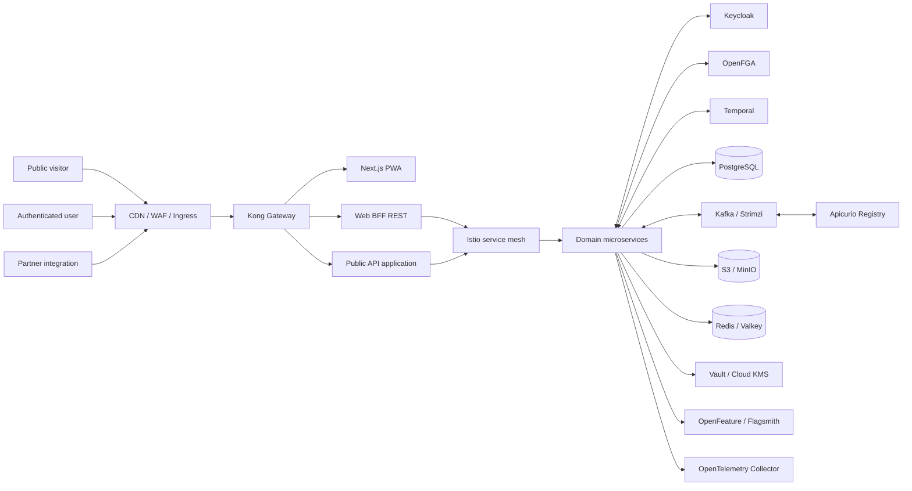

# Cài đặt Platform — Toàn bộ E2.x (umbrella chart)

> **Phạm vi**: triển khai toàn bộ platform Kubernetes của genealogy
> theo `tasks.md` E2.1 → E2.10 và `.kiro/specs/genealogy-platform/architecture-decisions.md`
> (ADR-E0.5-01 đến ADR-E0.5-16). Tài liệu này là **một điểm vào duy
> nhất** để cài cluster production/staging/on-prem/local-kind; chi
> tiết từng thành phần nằm trong các doc con (`docs/e23-kafka-apicurio-setup.md`,
> `docs/e24-temporal-setup.md`, …).
>
> Tất cả cấu hình là **config-as-code trong repo** (Helm umbrella
> chart `platform/helm/genealogy-platform/`) — không có gói cài
> binary độc lập ngoài Docker image của upstream platform.

## Khi nào dùng compose, khi nào dùng kind + Helm

> **Đọc phần này TRƯỚC khi chọn cách cài.** Hai cách có mục đích khác nhau
> và không thay thế nhau:

| Cách                                      | Là gì                                                                      | Thành phần chạy được                                                                                   | Thành phần KHÔNG chạy                                                                                                   | Dùng khi                                                                                                                     |
| ----------------------------------------- | -------------------------------------------------------------------------- | ------------------------------------------------------------------------------------------------------ | ----------------------------------------------------------------------------------------------------------------------- | ---------------------------------------------------------------------------------------------------------------------------- |
| **`docker compose up -d`** (cách A)       | Plain Docker container, KHÔNG có Kubernetes                                | Postgres, Keycloak, OpenFGA, Kafka, Apicurio, Temporal, MinIO, Valkey, Flagsmith, OTel Collector, Kong | Istio mesh mTLS, NetworkPolicy default-deny, Vault HA Raft, External Secrets, Argo CD/Rollouts, HPA, PDB, ResourceQuota | **Smoke test app** nhanh trên laptop. Verify service có start được, kết nối DB, push event. Không phản ánh production.       |
| **`kind` + Helm umbrella chart** (cách B) | Kubernetes cluster (1 control-plane + 2 worker) + `helm upgrade --install` | Tất cả E2.1 → E2.10, gồm cả Istio / Vault / Argo CD                                                    | (không có ngoại lệ)                                                                                                     | **Verify toàn bộ platform** đúng kiến trúc production trên laptop. Verify NetworkPolicy, mTLS, Helm-hook Job, CRD reconcile. |

### Tại sao `docker compose` KHÔNG đủ?

1. **Istio mesh mTLS + AuthorizationPolicy** — chỉ hoạt động qua Envoy sidecar trong K8s pod. Compose không có pod, không có sidecar injection.
2. **NetworkPolicy default-deny** — `docker network` không có equivalent. Compose chỉ dùng bridge network, mọi container thấy nhau.
3. **PDB + ResourceQuota + HPA + Argo Rollouts** — khái niệm thuần K8s.
4. **Vault HA Raft + External Secrets Operator** — cần CRD `ExternalSecret` / `SecretStore`, chỉ chạy trên K8s.
5. **Strimzi Kafka operator** — chart K8s dùng `Kafka` CRD để reconcile topic/user. Compose chỉ chạy raw Kafka broker 1-node, không có ACL/quota reconcile.

### Quy tắc chọn

- Bạn **chỉ muốn dev app logic**, không cần Istio/Vault/Argo CD → **A (compose)**.
- Bạn cần **verify đúng kiến trúc E2.x** (đặc biệt E2.5, E2.6, E2.9) → **B (kind + Helm)**.
- Bạn cần **cả hai** (vd: smoke test app + verify NetworkPolicy) → hybrid: Postgres chạy bằng compose, workload chạy trong kind (xem `docs/local-k8s-setup.md` Step 12).

**Trong doc này mặc định giả định cách B**. Nếu bạn chọn cách A, chỉ cần `cd platform/local && docker compose up -d` — KHÔNG theo các bước §2 trở đi.

> Trạng thái epic theo `tasks.md`:
>
> - [x] **E2.1** Cluster baseline (namespace, quota, NetworkPolicy, PDB, StorageClass)
> - [x] **E2.2** Kong Gateway
> - [x] **E2.3** Strimzi Kafka + Apicurio Schema Registry
> - [x] **E2.4** Temporal
> - [x] **E2.5** Istio service mesh
> - [x] **E2.6** Vault + cloud KMS abstraction
> - [x] **E2.7** S3/MinIO + Valkey
> - [ ] **E2.8** Flagsmith / OpenFeature
> - [ ] **E2.9** Argo CD / Rollouts
> - [ ] **E2.10** Grafana OSS stack (OTel Collector + Prometheus + Loki + Tempo + Grafana)

## 0. Cleanup / Uninstall (chạy TRƯỚC khi cài mới)

> **Khi nào chạy mục này**:
>
> - Cài lại cluster kind / dev từ đầu.
> - Đổi values (vd: bump version PostgreSQL, đổi storage class).
> - Cần reset về trạng thái sạch trước khi `helm upgrade` (vd:
>   values bị sai không thể recover).
> - Xóa platform khỏi cluster staging / dev.
>
> **CẢNH BÁO**:
>
> - Tất cả dữ liệu workflow / event / schema KHÔNG CÓ BACKUP sẽ
>   bị mất vĩnh viễn. Phải `pg_dump` + backup object storage TRƯỚC
>   khi chạy (xem §7).
> - Lệnh dưới đây **không thể undo**. Kiểm tra cluster + namespace
>   trước khi chạy.

### 0.1 BACKUP TRƯỚC (BẮT BUỘC cho production)

```bash
# 1. PostgreSQL dump (mọi DB nền tảng)
mkdir -p /tmp/gp-backup-$(date +%Y%m%d-%H%M%S)
cd /tmp/gp-backup-$(date +%Y%m%d-%H%M%S)

for db in genea_shared genea_tenant genea_genealogy genea_research \
          genea_collaboration genea_media genea_search genea_importexport \
          genea_dna genea_notification genea_reporting genea_audit \
          genea_temporal genea_apicurio genea_keycloak genea_openfga \
          genea_flagsmith; do
  kubectl -n gp-data exec postgres-0 -- \
    pg_dump -U postgres -d $db 2>/dev/null > $db.sql || \
    echo "skip $db (not present)"
done

# 2. MinIO bucket snapshot (object storage)
mc alias set local http://minio.gp-data.svc.cluster.local:9000 \
  "$MINIO_ROOT_USER" "$MINIO_ROOT_PASSWORD"
mc mirror --remove --overwrite local/media /tmp/gp-backup-*/media
mc mirror --remove --overwrite local/media-quarantine /tmp/gp-backup-*/media-quarantine
mc mirror --remove --overwrite local/dna-raw /tmp/gp-backup-*/dna-raw
mc mirror --remove --overwrite local/import-export /tmp/gp-backup-*/import-export

# 3. Vault unseal keys + Raft snapshot (E14.1 procedure)
kubectl -n gp-platform exec vault-0 -- \
  vault operator raft snapshot /tmp/gp-backup-*/vault-$(date +%Y%m%d).snap

# 4. Argo CD Application history (GitOps repo, không cần backup thủ công)

# 5. Upload lên S3 hoặc backup server ngoài cluster
aws s3 sync /tmp/gp-backup-$(date +%Y%m%d-%H%M%S) \
  s3://gp-backups/pre-cleanup-$(date +%Y%m%d-%H%M%S)/
```

### 0.2 Xác nhận cluster trước khi xóa

```bash
# 1. Kiểm tra context cluster hiện tại
kubectl config current-context
# Kỳ vọng: <cluster bạn muốn xóa> — KHÔNG ĐƯỢC là cluster production
# chính nếu chưa backup + verify backup OK.

# 2. Xem danh sách Helm release
helm list -A | grep -E "genealogy-platform|strimzi|external-secrets|cert-manager|argocd"
# Kỳ vọng: chỉ thấy các release nằm trong platform setup này.

# 3. Xem tổng resources platform
kubectl get all,networkpolicy,configmap,secret -n \
  gp-platform,gp-edge,gp-bff,gp-services,gp-workers,gp-data,gp-observability,gp-argocd \
  2>/dev/null | wc -l
# Nếu số lớn bất thường (>1000) — dừng lại, kiểm tra kỹ trước khi xóa.
```

### 0.3 Gỡ Helm release umbrella chart (một lệnh duy nhất)

> Tất cả lệnh trong doc này chạy từ **repo root**:
> `cd /Users/ngocshb/IdeaProjects/scented5apathy-ship-it/gp`
> (thay bằng đường dẫn tới checkout của bạn nếu khác).

```bash
# Gỡ umbrella chart — xóa tất cả resources mà chart đã tạo
# (StatefulSet, Deployment, ConfigMap, NetworkPolicy, ServiceAccount, Job, ...)
helm uninstall genealogy-platform -n gp-platform
# Kỳ vọng: release "genealogy-platform" uninstalled

# Verify đã xóa hết resources managed-by-Helm
kubectl get all -n gp-data -l app.kubernetes.io/part-of=genealogy-platform \
  --show-labels 2>/dev/null | head -5
# Kỳ vọng: "No resources found" (umbrella chart xóa hết resources
# trong gp-data trừ Postgres + secrets).
```

### 0.4 Gỡ Strimzi operator + Kafka custom resources

> **CẢNH BÁO**: Bước này xóa TẤT CẢ Kafka topic + user + cluster.
> Chỉ chạy nếu backup PostgreSQL OK.

```bash
# 1. Xóa Kafka cluster (Strimzi sẽ cleanup state)
kubectl -n gp-data delete kafka genea-kafka
# Kỳ vọng: kafkas.kafka.strimzi.io "genea-kafka" deleted

# 2. Đợi Strimzi operator cleanup (PVC + statefulset)
kubectl -n gp-data wait --for=delete kafka/genea-kafka --timeout=120s
# Nếu timeout: kiểm tra `kubectl -n gp-data get pods -l strimzi.io/cluster=genea-kafka`
# còn statefulset nào không.

# 3. Xóa Strimzi operator Helm release
helm uninstall strimzi -n strimzi
# Kỳ vọng: release "strimzi" uninstalled

# 4. Xóa Strimzi CRD (CHỈ khi không có Kafka nào khác trong cluster)
kubectl delete crd kafkas.kafka.strimzi.io \
  kafkatopics.kafka.strimzi.io \
  kafkausers.kafka.strimzi.io \
  kafkaconnectors.kafka.strimzi.io \
  kafkaconnects.kafka.strimzi.io \
  kafkamirrormaker2s.kafka.strimzi.io \
  kafkarebalances.kafka.strimzi.io
# Kỳ vọng: 7 CRD xóa sạch.
```

### 0.5 Gỡ Temporal namespace + queue (nếu muốn reset sạch)

> Helm-hook Jobs tạo namespace + queue chạy MỖI lần `helm upgrade`,
> nhưng KHÔNG xóa khi `helm uninstall`. Để reset hoàn toàn:

```bash
# 1. Xóa các namespace (giữ genea-default)
kubectl -n gp-data run temporal-tctl --rm -it --restart=Never \
  --image=temporalio/admin-tools:1.26.2 -- sh -c '
    for ns in genea-genealogy genea-media genea-search genea-interop \
              genea-notify genea-reporting genea-dna; do
      tctl --address temporal.gp-data.svc.cluster.local:7233 \
        namespace delete --namespace $ns
    done
    # genea-default giữ lại (auto-setup image cần nó để boot)
  '
# Kỳ vọng: 7 namespace xóa, genea-default còn lại.

# 2. (Optional) Xóa Temporal history trong Postgres
kubectl -n gp-data exec postgres-0 -- \
  psql -U postgres -c "DROP DATABASE IF EXISTS genea_temporal;"
# Kỳ vọng: DROP DATABASE. Lần cài sau Temporal sẽ tạo lại schema.
```

### 0.6 Xóa platform namespace (nếu muốn reset hoàn toàn)

> **CẢNH BÁO**: Lệnh này xóa TẤT CẢ resources (kể cả PVC + secret
>
> - Argo CD Application) trong 8 namespace. Backup trước!

```bash
# 1. Xóa Argo CD Application trước (nếu dùng Argo CD)
argocd app delete genealogy-platform-saas --cascade=false
# --cascade=false để Argo CD không xóa resources ngay — để helm uninstall xử lý.

# 2. Xóa PVC (Strimzi Kafka, Apicurio Postgres, Temporal cache)
kubectl delete pvc -n gp-data --all
# Kỳ vọng: tất cả PVC xóa sạch. Volume trên cloud sẽ được reclaim
# theo StorageClass reclaimPolicy (mặc định "Retain" trong chart).

# 3. Xóa từng namespace
for ns in gp-edge gp-bff gp-services gp-workers gp-data gp-observability gp-argocd gp-platform; do
  kubectl delete namespace $ns --wait=false
done
# Kỳ vọng: 8 namespace Terminating. Pod cleanup tự động.

# 4. Verify
sleep 30
kubectl get ns -l app.kubernetes.io/part-of=genealogy-platform
# Kỳ vọng: "No resources found" — sạch.
```

### 0.7 Gỡ operator bên ngoài (cert-manager + External Secrets)

> Chỉ chạy nếu BẠN ĐÃ CÀI các operator này CHO platform setup này.
> Nếu cluster dùng chung với project khác, BỎ QUA bước này.

```bash
# 1. Xóa cert-manager
helm uninstall cert-manager -n cert-manager
kubectl delete namespace cert-manager --wait=false

# 2. Xóa External Secrets Operator
helm uninstall external-secrets -n external-secrets
kubectl delete namespace external-secrets --wait=false

# 3. (Optional) Xóa Argo CD hoàn toàn
helm uninstall argocd -n argocd
kubectl delete namespace argocd --wait=false
# Kỳ vọng: 3 namespace xóa.
```

### 0.8 Xóa StorageClass + Postgres (nếu muốn reset cluster)

```bash
# 1. Xóa StorageClass (CHỈ khi không có workload khác dùng)
kubectl delete storageclass gp-data-ssd gp-data-hdd gp-data-nvme
# Kỳ vọng: 3 StorageClass xóa. Nếu có workload dùng → sẽ stuck ở
# "waiting for finalizer" → xóa thủ công qua:
# kubectl patch storageclass gp-data-ssd -p '{"metadata":{"finalizers":null}}'

# 2. Xóa Postgres StatefulSet (nếu dùng Helm postgres chart)
helm uninstall postgres -n gp-data 2>/dev/null
kubectl delete pvc -n gp-data data-postgres-0 2>/dev/null

# 3. (Optional) Xóa luôn gp-data namespace
kubectl delete namespace gp-data --wait=false
```

### 0.9 Verify cluster sạch

```bash
# 1. Tất cả genealogy resources đã sạch
kubectl get all,networkpolicy,configmap,secret,pvc,storageclass \
  -l app.kubernetes.io/part-of=genealogy-platform -A 2>/dev/null | wc -l
# Kỳ vọng: 0

# 2. Helm list không còn release
helm list -A | grep -E "genealogy|strimzi|cert-manager|external-secrets|argocd" | wc -l
# Kỳ vọng: 0

# 3. Docker cleanup (nếu có pod chạy local)
docker rm -f gp-postgres gp-kafka gp-apicurio gp-temporal gp-pg-smoke \
  gp-temporal-smoke gp-keycloak gp-openfga gp-minio gp-valkey gp-flagsmith \
  gp-otel-collector gp-kong 2>/dev/null
docker network rm gp-smoke 2>/dev/null
docker volume prune -f
docker image prune -f --filter "label=org.opencontainers.image.title=genealogy-platform"

# 4. kind cluster (chỉ local)
kind delete cluster --name gp-e2x
```

### 0.10 Rollback sau cleanup (nếu cần)

Nếu sau khi cleanup bạn nhận ra dữ liệu quan trọng bị mất:

```bash
# 1. Tái tạo cluster + baseline (§3 của doc này)
# 2. Restore Postgres từ backup (đường dẫn tùy backup của bạn)
gunzip -c /tmp/gp-backup-20260809-103000/genea_temporal.sql.gz | \
  kubectl -n gp-data exec -i postgres-0 -- \
  psql -U postgres -d genea_temporal

# 3. Restore MinIO bucket
mc mirror /tmp/gp-backup-20260809-103000/media local/media

# 4. Re-apply umbrella chart (chạy từ repo root)
helm upgrade --install genealogy-platform \
  platform/helm/genealogy-platform \
  --namespace gp-platform \
  --values platform/helm/genealogy-platform/values.yaml \
  --values platform/helm/genealogy-platform/values-saas.yaml \
  --wait --timeout 10m
```

### 0.11 Cleanup nhanh (1 lệnh, local kind cluster, KHÔNG backup)

> **CHỈ dùng cho local kind cluster**. Không chạy trên cluster
> shared / staging / production.

```bash
# Xóa sạch + tái tạo kind cluster (cần cài kind binary)
kind delete cluster --name gp-e2x
rm -rf ~/.kube 2>/dev/null

# Tái tạo
cat <<EOF > /tmp/gp-kind.yaml
kind: Cluster
apiVersion: kind.x-k8s.io/v1alpha4
nodes:
  - role: control-plane
  - role: worker
  - role: worker
EOF
kind create cluster --config /tmp/gp-kind.yaml --name gp-e2x
kubectl cluster-info
# Sau đó quay lại §2.2 (prerequisites) + §3 (baseline).
```

## 1. Tổ quan platform



### 1.1 Thành phần đã verify (E2.1 – E2.4)

| Thành phần                                           | Phiên bản (ADR-E0.5-01)         | Epic | Trạng thái | Vai trò                                              |
| ---------------------------------------------------- | ------------------------------- | ---- | ---------- | ---------------------------------------------------- |
| Cluster baseline (8 namespace + NetworkPolicy + PDB) | n/a                             | E2.1 | ✅ DONE    | Foundation chung                                     |
| Kong Gateway (DB-less, declarative)                  | `3.8.x`                         | E2.2 | ✅ DONE    | Edge gateway, route/plugin                           |
| Strimzi Kafka (KRaft, ACL, topic quota)              | Kafka `3.8.x`, Strimzi `0.45.x` | E2.3 | ✅ DONE    | Event bus                                            |
| Apicurio Schema Registry (Avro + BACKWARD)           | `3.3.x`                         | E2.3 | ✅ DONE    | Schema store                                         |
| Temporal (self-hosted)                               | `1.26.2`                        | E2.4 | ✅ DONE    | Durable workflow / saga                              |
| Temporal admin-tools                                 | `1.26.2`                        | E2.4 | ✅ DONE    | Helm-hook Job reconcile namespaces + task queues     |
| Temporal UI                                          | `2.5.0`                         | E2.4 | ✅ DONE    | Read-only operator console                           |
| PostgreSQL (gp-data cluster)                         | `16-alpine`                     | E2.1 | ✅ DONE    | Persistence cho Temporal + Apicurio + keycloak + ... |

### 1.2 Thành phần sẽ bổ sung (E2.5 – E2.10)

| Thành phần                                           | Phiên bản (ADR-E0.5-01)            | Epic    | Vai trò                                       |
| ---------------------------------------------------- | ---------------------------------- | ------- | --------------------------------------------- |
| Istio (service mesh + mTLS)                          | `1.23.x`                           | E2.5 ✅ | mTLS workload identity + AuthorizationPolicy  |
| Vault + cloud KMS abstraction                        | `1.17.x`                           | E2.6    | Short-lived credentials + envelope encryption |
| S3/MinIO + bucket policy                             | n/a                                | E2.7    | Object storage + signed URL                   |
| Valkey (Redis-compatible)                            | `7.2-alpine`                       | E2.7    | Cache/session/rate state                      |
| Flagsmith + OpenFeature SDK                          | LTS                                | E2.8    | Feature flag với safe fallback                |
| Argo CD + Rollouts                                   | Argo CD `2.13.x`, Rollouts `1.7.x` | E2.9    | GitOps + canary deploy                        |
| OTel Collector + Prometheus + Loki + Tempo + Grafana | latest stable                      | E2.10   | Observability stack                           |

## 2. Prerequisites (chung cho mọi môi trường)

### 2.1 Toolchain

| Tool      | Phiên bản | Verify                         |
| --------- | --------- | ------------------------------ |
| `docker`  | `>= 24`   | `docker --version`             |
| `kubectl` | `>= 1.30` | `kubectl version --short`      |
| `helm`    | `>= 3.14` | `helm version --short`         |
| `node`    | `22 LTS`  | `node --version`               |
| `pnpm`    | `>= 9`    | `pnpm --version`               |
| `kind`    | `>= 0.24` | `kind version` (chỉ cho local) |

Xem `docs/local-toolchain-setup.md` để cài các tool trên.

### 2.2 Kubernetes cluster

- Cluster version `>= 1.28.0` (theo `platform/helm/genealogy-platform/Chart.yaml`).
- Ít nhất 3 node (1 control-plane + 2 worker) cho production; kind
  cluster cho local (xem `docs/local-k8s-setup.md`).
- `kubectl` context đang trỏ vào cluster đúng:

  ```bash
  kubectl config current-context
  # Kỳ vọng: kind-gp-e2x (local) hoặc <prod-cluster-name> (production)
  ```

### 2.3 Cert-manager (optional nhưng khuyến nghị)

Cần cho Kong ingress TLS và một số UI. Cài **một lần per cluster**:

```bash
helm repo add jetstack https://charts.jetstack.io
helm repo update
helm install cert-manager jetstack/cert-manager \
  --namespace cert-manager --create-namespace \
  --version v1.16.0 \
  --set installCRDs=true
```

Verify:

```bash
kubectl get crd | grep cert-manager
# Kỳ vọng: certificates.cert-manager.io, certificaterequests.cert-manager.io, ...
```

### 2.4 External Secrets Operator (cho production)

Cần để chart tự đồng bộ secret từ Vault / AWS Secrets Manager /
GCP Secret Manager. Cài **một lần per cluster**:

```bash
helm repo add external-secrets https://charts.external-secrets.io
helm repo update
helm install external-secrets external-secrets/external-secrets \
  --namespace external-secrets --create-namespace \
  --set installCRDs=true
```

Verify:

```bash
kubectl get crd | grep external-secrets
# Kỳ vọng: externalsecrets.external-secrets.io, secretstores.external-secrets.io, ...
```

### 2.5 Container registry + Cosign

Production phải pull image từ registry riêng (mirror cho air-gap)
và verify Cosign signature:

```bash
cosign verify --key https://example.com/cosign.pub \
  ghcr.io/genealogy/temporal:1.26.2
```

Local dev dùng Docker Hub (registry.io, quay.io) — không cần Cosign.

## 3. Cluster baseline (E2.1)

E2.1 thiết lập 8 namespace, ResourceQuota, Pod Security, default-deny
NetworkPolicy, PodDisruptionBudget, StorageClass encryption.

### 3.1 Apply baseline

> **Quan trọng**: chạy tất cả lệnh dưới đây từ **repo root**
> (`/Users/ngocshb/IdeaProjects/scented5apathy-ship-it/gp`).
> Các đường dẫn Helm (`platform/helm/...`) là relative tới repo root.

```bash
# (đã cd vào repo root trước đó)

# Render toàn bộ umbrella chart (kiểm tra chart hợp lệ)
helm template genealogy-platform \
  platform/helm/genealogy-platform \
  --values platform/helm/genealogy-platform/values.yaml \
  --values platform/helm/genealogy-platform/values-saas.yaml \
  > /tmp/gp-rendered.yaml

# Apply chỉ baseline (Namespace + ResourceQuota + NetworkPolicy + PDB + StorageClass)
# bằng --show-only cho từng template (cách an toàn nhất):
for tpl in \
  templates/baseline/namespaces.yaml \
  templates/baseline/network-policies.yaml \
  templates/baseline/pod-disruption-budgets.yaml \
  templates/baseline/storage-classes.yaml; do
  kubectl apply -f <(helm template genealogy-platform \
    platform/helm/genealogy-platform \
    --values platform/helm/genealogy-platform/values.yaml \
    --values platform/helm/genealogy-platform/values-saas.yaml \
    --show-only "$tpl")
done
```

Verify:

```bash
kubectl get ns -l app.kubernetes.io/part-of=genealogy-platform
# Kỳ vọng: 8 namespace — gp-platform, gp-edge, gp-bff, gp-services,
#          gp-workers, gp-data, gp-observability, gp-argocd

kubectl get networkpolicy -A | grep -c default-deny
# Kỳ vọng: 8 (một per namespace)

kubectl get pdb -A -o wide
# Kỳ vọng: 3 PDB ở gp-platform (kong-no-disruption, vault-no-disruption,
#          keycloak-no-disruption) với MAX UNAVAILABLE=0 — tương ứng 3
#          workload single-replica. KHÔNG phải 1 PDB per namespace.

kubectl get sc gp-data-ssd -o yaml | grep encrypted
# Kỳ vọng: encrypted: "true"
```

### 3.2 Provision PostgreSQL (dùng cho Apicurio + Temporal + Keycloak)

E2.1 baseline KHÔNG tự cài Postgres — bạn cần 1 trong 3 lựa chọn:

**Lựa chọn A — Managed cloud (AWS RDS / GCP Cloud SQL / Azure Database)**:

```bash
# Tạo RDS instance (ví dụ AWS)
aws rds create-db-instance \
  --db-instance-identifier gp-postgres-prod \
  --db-instance-class db.r6g.large \
  --engine postgres --engine-version 16.4 \
  --master-username postgres \
  --master-user-password "$POSTGRES_PASSWORD" \
  --allocated-storage 100 --storage-encrypted \
  --vpc-security-group-ids sg-xxx \
  --db-subnet-group-name gp-data-subnets
# Endpoint: gp-postgres-prod.xxx.rds.amazonaws.com
```

**Lựa chọn B — Helm postgres operator (Bitnami / Zalando / Crunchy)**:

```bash
# Bitnami (đơn giản nhất)
helm repo add bitnami https://charts.bitnami.com/bitnami
helm install postgres bitnami/postgresql \
  --namespace gp-data \
  --set auth.postgresPassword="$POSTGRES_PASSWORD" \
  --set auth.database=genea_shared \
  --set primary.persistence.size=100Gi \
  --set primary.persistence.storageClass=gp-data-ssd \
  --version 16.0.0
```

**Lựa chọn C — kind cluster (local) — hybrid với docker compose**:

`platform/local/docker-compose.yml` dựng **toàn bộ data plane + edge
stack** bằng Docker container, rồi **kind cluster** chạy workload pods
qua Helm umbrella chart và **kết nối ngược vào Postgres/Keycloak/etc.
trong compose**.

| Service                                                          | Image                                          | Vai trò                        | Chạy bằng                      |
| ---------------------------------------------------------------- | ---------------------------------------------- | ------------------------------ | ------------------------------ |
| `postgres`                                                       | `postgres:16-alpine`                           | Persistence cho mọi DB         | docker compose                 |
| `keycloak`                                                       | `quay.io/keycloak/keycloak:26.0`               | Identity (E3.1)                | docker compose                 |
| `openfga`                                                        | `openfga/openfga:1.10`                         | Authorization (E3.3)           | docker compose                 |
| `kafka`                                                          | `quay.io/strimzi/kafka:0.43.0-kafka-3.8.0`     | Event bus (E2.3, KRaft 1-node) | docker compose                 |
| `apicurio`                                                       | `apicurio/apicurio-registry:2.6`               | Schema registry (E2.3)         | docker compose                 |
| `temporal`                                                       | `temporalio/auto-setup:1.26.2`                 | Workflow (E2.4)                | docker compose                 |
| `minio`                                                          | `minio/minio:RELEASE.2024-10-13T13-34-11Z`     | S3-compatible storage (E2.7)   | docker compose                 |
| `valkey`                                                         | `valkey/valkey:7.2-alpine`                     | Cache (E2.7)                   | docker compose                 |
| `flagsmith`                                                      | `flagsmith/flagsmith:latest`                   | Feature flag (E2.8)            | docker compose                 |
| `otel-collector`                                                 | `otel/opentelemetry-collector-contrib:0.110.0` | Telemetry pipeline (E2.10)     | docker compose                 |
| `kong`                                                           | `kong:3.8.0`                                   | Edge gateway (E2.2)            | docker compose                 |
| Istio mesh / Vault HA / Argo CD / Rollouts / NetworkPolicy / PDB | (không có ở compose)                           | Platform K8s                   | **kind + Helm umbrella chart** |

#### Bước triển khai Lựa chọn C

**P1. Cài compose stack (NGOÀI doc này)**:

```bash
cd platform/local
cp .env.local.example .env.local
# SỬA 3 biến "change-me-local-only" thành giá trị bất kỳ (không
# trùng password production). Nếu giữ placeholder, container sẽ
# start nhưng Postgres / Keycloak / MinIO sẽ reject login.
# Lưu ý: docker compose chỉ auto-load file tên `.env`, KHÔNG auto-load
# `.env.local`. Sau khi điền xong phải rename:
mv .env.local .env
# (.env đã được .gitignore cover tại platform/local/.env — an toàn.)

docker compose --profile default up -d
docker compose ps                   # verify 11 container "running"
```

Nếu vẫn thấy cảnh báo `WARN: The "POSTGRES_PASSWORD" variable is not set`,
kiểm tra file `.env` không có BOM/CRLF:

```bash
file .env
# "ASCII text"  → OK
# "with BOM"    → sed -i '' $'1s/^\xEF\xBB\xBF//' .env
# "with CRLF"   → sed -i '' 's/\r$//' .env
```

Verify Postgres lắng nghe:

```bash
docker exec gp-postgres pg_isready -U "${POSTGRES_USER:-genealogy}"
# Kỳ vọng: accepting connections
```

**P2. Tạo kind cluster (theo §3.1 của doc này, nhưng BỎ QUA block Postgres)**:

`§3.1 Apply baseline` chỉ chạy 4 template:

```bash
cd /Users/ngocshb/IdeaProjects/scented5apathy-ship-it/gp

for tpl in \
  templates/baseline/namespaces.yaml \
  templates/baseline/network-policies.yaml \
  templates/baseline/pod-disruption-budgets.yaml \
  templates/baseline/storage-classes.yaml; do
  kubectl apply -f <(docker run --rm -i -v "${PWD}:/src:ro" -w /src alpine/helm:3.16.3 \
    template genealogy-platform platform/helm/genealogy-platform \
    --values platform/helm/genealogy-platform/values.yaml \
    --values platform/helm/genealogy-platform/values-saas.yaml \
    --show-only "$tpl")
done
```

**KHÔNG** chạy Helm block Postgres nào — Postgres nằm trong compose.

**P3. Map DNS `postgres.gp-data.svc.cluster.local` → compose Postgres** (NGOÀI doc này):

Từ kind cluster, `kubectl exec postgres-0 -- psql ...` không hoạt động vì không có Postgres pod trong kind. Có 2 cách:

- **(khuyến nghị)** Dùng `docker compose run --rm postgres psql -h postgres -U ...` thay cho `kubectl -n gp-data exec postgres-0 --`.
- Hoặc expose Postgres qua NodePort / kind port-mapping rồi trỏ chart value `temporal.postgresql.host` về host đó (xem `docs/local-k8s-setup.md` Step 12).

**P4. Chạy §3.3 / §3.4 / §4 với chỉnh sửa sau**:

| Step trong doc                      | Lựa chọn C làm gì?                                                                                                                                                                                                                       |
| ----------------------------------- | ---------------------------------------------------------------------------------------------------------------------------------------------------------------------------------------------------------------------------------------- |
| §3.3 Tạo database nền tảng          | Chạy lệnh `psql` qua **docker exec** (không `kubectl exec`). Đổi `PG_HOST=postgres` (container name) thay vì `postgres.gp-data.svc.cluster.local`.                                                                                       |
| §3.4 Tạo secret                     | Giữ nguyên `kubectl create secret` — secret vẫn reference trong kind cluster. Username/password trỏ vào Postgres compose.                                                                                                                |
| §4 Apply umbrella chart             | BỎ QUA mọi chart con tạo Postgres StatefulSet. Chạy `helm upgrade --install` với values override `temporal.postgresql.host=postgres.platform-local`, `apicurio.postgresql.host=postgres.platform-local` (xem `values-dev.yaml` patches). |
| §4.1–4.3 Verify Kong/Kafka/Temporal | Có — nhưng Kafka/Temporal pods **trong kind** sẽ kết nối compose (qua NodePort hoặc ExternalName Service). Verify bằng `kubectl exec <pod> -- nc -zv <compose-svc> <port>`.                                                              |
| §4.2.1 Cài Strimzi operator         | **BỎ QUA** nếu Kafka đã chạy trong compose (operator chỉ cần khi chart tạo Kafka CR trong kind).                                                                                                                                         |
| §5 Verify                           | Có — kiểm tra cả pod trong kind lẫn container trong compose.                                                                                                                                                                             |

**P5. Tham chiếu chi tiết**: xem `docs/local-k8s-setup.md` Step 12 (compose + kind hybrid với NetworkPolicy allow rule cho compose subnet) và `platform/local/README.md` §3.

### 3.3 Tạo các database nền tảng

Một lần per cluster:

```bash
# Lấy password từ External Secret hoặc manual
PG_HOST=postgres.gp-data.svc.cluster.local
PG_PASS=$(kubectl -n gp-data get secret temporal-postgres-credentials \
  -o jsonpath='{.data.password}' | base64 -d)

# Tạo database (idempotent)
kubectl -n gp-data exec -i postgres-0 -- psql -U postgres <<'EOF'
DO $$
BEGIN
  IF NOT EXISTS (SELECT FROM pg_catalog.pg_roles WHERE rolname = 'temporal') THEN
    CREATE ROLE temporal LOGIN PASSWORD 'REPLACE_ME_VIA_SECRET';
  END IF;
  IF NOT EXISTS (SELECT FROM pg_catalog.pg_roles WHERE rolname = 'apicurio') THEN
    CREATE ROLE apicurio LOGIN PASSWORD 'REPLACE_ME_VIA_SECRET';
  END IF;
END
$$;

SELECT 'CREATE DATABASE genea_temporal OWNER temporal'
WHERE NOT EXISTS (SELECT FROM pg_database WHERE datname = 'genea_temporal')\gexec

SELECT 'CREATE DATABASE genea_apicurio OWNER apicurio'
WHERE NOT EXISTS (SELECT FROM pg_database WHERE datname = 'genea_apicurio')\gexec

\c genea_temporal
GRANT ALL PRIVILEGES ON SCHEMA public TO temporal;

\c genea_apicurio
GRANT ALL PRIVILEGES ON SCHEMA public TO apicurio;
EOF
```

### 3.4 Tạo các secret (qua External Secrets hoặc manual)

```bash
# External Secrets — production (khuyến nghị)
cat <<EOF | kubectl apply -f -
apiVersion: external-secrets.io/v1beta1
kind: SecretStore
metadata:
  name: vault-backend
  namespace: gp-data
spec:
  provider:
    vault:
      server: https://vault.example.com:8200
      path: secret/data/gp/data
      auth:
        kubernetes:
          mountPath: kubernetes
          role: gp-data
---
apiVersion: external-secrets.io/v1beta1
kind: ExternalSecret
metadata:
  name: temporal-postgres-credentials
  namespace: gp-data
spec:
  secretStoreRef:
    name: vault-backend
    kind: SecretStore
  target:
    name: temporal-postgres-credentials
  data:
    - secretKey: username
      remoteRef:
        key: temporal/postgres
        property: username
    - secretKey: password
      remoteRef:
        key: temporal/postgres
        property: password
EOF

# Manual — local dev (KHÔNG commit password thật vào Git)
kubectl -n gp-data create secret generic temporal-postgres-credentials \
  --from-literal=username=postgres \
  --from-literal=password="$POSTGRES_PASSWORD"

kubectl -n gp-data create secret generic apicurio-postgres \
  --from-literal=username=postgres \
  --from-literal=password="$POSTGRES_PASSWORD"
```

Verify:

```bash
kubectl -n gp-data get secret temporal-postgres-credentials
# Kỳ vọng: TYPE=Opaque, 2 keys (username, password), AGE=<recent>

kubectl -n gp-data get secret apicurio-postgres
# Kỳ vọng: TYPE=Opaque, 2 keys (username, password), AGE=<recent>
```

## 4. Cài đặt từng thành phần (qua umbrella chart)

Sau khi baseline xong, install tất cả thành phần qua MỘT lệnh duy
nhất — umbrella chart render mọi E2.x:

```bash
# (chạy từ repo root)

# Apply toàn bộ umbrella chart
helm upgrade --install genealogy-platform \
  platform/helm/genealogy-platform \
  --namespace gp-platform \
  --values platform/helm/genealogy-platform/values.yaml \
  --values platform/helm/genealogy-platform/values-saas.yaml \
  --wait --timeout 10m
```

Chart render khoảng 92 resources (xem `evidence/E2.4.md` §Live
verification cho con số chính xác từng môi trường).

### 4.1 E2.2 Kong Gateway

**Trạng thái**: ✅ DONE (chart render).

**Auto-apply khi chạy lệnh §4**. Verify:

```bash
kubectl -n gp-edge get deploy kong
# Kỳ vọng: 3/3 Ready (SaaS) hoặc 1/1 (dev)

kubectl -n gp-edge get cm kong-declarative-config -o jsonpath='{.data.kong\.yml}' | head -50
# Kỳ vọng: _format_version: "3.0", 4 route classes (public/authenticated/partner/admin)

kubectl -n gp-edge logs -l app.kubernetes.io/component=kong --tail=50 | grep "KONG_PLUGINS"
# Kỳ vọng: KONG_PLUGINS=bundled,correlation-id,cors,...
```

**Troubleshooting**: xem `docs/e23-kafka-apicurio-setup.md` §7
(phần Kong dùng chung pattern troubleshoot).

Chi tiết: `platform/kong/README.md` + `evidence/E2.2.md`.

### 4.2 E2.3 Strimzi Kafka + Apicurio Schema Registry

**Trạng thái**: ✅ DONE (chart render).

**Auto-apply khi chạy lệnh §4** — nhưng có **prerequisite bổ sung**:
Strimzi operator phải được cài độc lập trước (chart chỉ ship
`Kafka`/`KafkaTopic`/`KafkaUser` CR, không ship operator).

#### 4.2.1 Cài Strimzi operator (một lần per cluster)

**Cách A — Helm repo (khuyến nghị)**:

```bash
helm repo add strimzi https://strimzi.io/charts/
helm repo update
helm install strimzi strimzi/strimzi-kafka-operator \
  --namespace strimzi --create-namespace \
  --version 0.45.2 \
  --set watchAnyNamespace=true
```

> **Lưu ý**: Strimzi `0.45.2` (ADR-E0.5-01 supersession). Không
> dùng `0.43.0` (entity-operator Admin API bug trên kind — xem
> `evidence/E2.3.md`).

**Cách B — OperatorHub / OLM (OpenShift)**:

```bash
cat <<EOF | kubectl apply -f -
apiVersion: operators.coreos.com/v1alpha1
kind: Subscription
metadata:
  name: strimzi-kafka-operator
  namespace: openshift-operators
spec:
  channel: stable
  installPlanApproval: Manual
  name: strimzi-kafka-operator
  source: operatorhubio-catalog
  sourceNamespace: olm
  startingCSV: strimzi-cluster-operator.v0.45.2
EOF
```

Verify operator:

```bash
kubectl get crd | grep kafka.strimzi.io
# Kỳ vọng: kafkas.kafka.strimzi.io, kafkatopics.kafka.strimzi.io,
#          kafkausers.kafka.strimzi.io, ...

kubectl -n strimzi get deploy strimzi-cluster-operator
# Kỳ vọng: 1/1 Ready
```

#### 4.2.2 Verify Kafka cluster + Apicurio

```bash
# Kafka cluster Ready
kubectl -n gp-data get kafka genea-kafka
# Kỳ vọng: READY=True sau ~3-5 phút

# Topics reconciled
kubectl -n gp-data get kafkatopics | wc -l
# Kỳ vọng: 11 (đúng danh sách trong platform/kafka/topics.yaml)

# Users reconciled
kubectl -n gp-data get kafkausers | wc -l
# Kỳ vọng: 14 (1 admin + 7 producer + 6 consumer)

# Apicurio probe
kubectl -n gp-data get deploy apicurio-registry
# Kỳ vọng: 2/2 Ready

kubectl -n gp-data exec deploy/apicurio-registry -- \
  curl -s http://localhost:8080/apis/registry/v2/system/info | jq '.version'
# Kỳ vọng: "3.3.x"
```

**Troubleshooting**: xem `docs/e23-kafka-apicurio-setup.md` §7.

Chi tiết: `platform/kafka/README.md` + `platform/apicurio/README.md`

- `evidence/E2.3.md`.

### 4.3 E2.4 Temporal

**Trạng thái**: ✅ DONE (chart render).

**Auto-apply khi chạy lệnh §4**. Helm-hook Jobs (`temporal-namespace-init`,
`temporal-task-queue-init`) tạo 8 namespaces + 10 task queues trước
khi StatefulSet roll.

Verify:

```bash
# StatefulSet Ready
kubectl -n gp-data get pods -l app.kubernetes.io/component=temporal
# Kỳ vọng: temporal-0   1/1 Running

# gRPC port mở
kubectl -n gp-data exec temporal-0 -- ss -lnt | grep 7233
# Kỳ vọng: LISTEN 0.0.0.0:7233

# Namespaces (dùng tctl qua admin-tools)
kubectl -n gp-data run temporal-tctl --rm -it --restart=Never \
  --image=temporalio/admin-tools:1.26.2 \
  -- tctl --address temporal.gp-data.svc.cluster.local:7233 namespace list
# Kỳ vọng: 8 dòng namespace — genea-default, genea-genealogy, genea-media,
#          genea-search, genea-interop, genea-notify, genea-reporting, genea-dna

# Search attributes (9 opaque-ID-only fields)
kubectl -n gp-data run temporal-tctl --rm -it --restart=Never \
  --image=temporalio/admin-tools:1.26.2 \
  -- tctl --address temporal.gp-data.svc.cluster.local:7233 \
     search-attribute list
# Kỳ vọng: TenantId, WorkflowType, TaskQueue, Attempt, AggregateType,
#          AggregateId, MediaAssetId, TransferJobId, ConsentId
```

**Troubleshooting**: xem `docs/e24-temporal-setup.md` §6
(12-mục matrix).

Chi tiết: `platform/temporal/README.md` + `runbook/temporal.md`

- `evidence/E2.4.md`.

### 4.4 E2.5 Istio service mesh

**Trạng thái**: ✅ DONE (chart render + bootstrap Job + 4 source-of-truth manifests).

**Auto-apply khi chạy lệnh §4**. Helm-hook Job (`istio-bootstrap`,
`pre-install,pre-upgrade`) áp 4 source-of-truth manifests (MeshConfig +
PeerAuthentication + AuthorizationPolicy + Telemetry) qua
`kubectl apply --server-side`.

Verify:

```bash
# 1. Control plane Ready
kubectl -n gp-platform get pods -l app=istiod
# Kỳ vọng: istiod-xxx  1/1 Running

# 2. Bootstrap Job complete
kubectl -n gp-platform get jobs -l app.kubernetes.io/component=istio-bootstrap
# Kỳ vọng: istio-bootstrap  Complete  1/1

# 3. 4 ConfigMaps rendered
kubectl -n gp-platform get cm -l app.kubernetes.io/component=istio | grep genea-istio
# Kỳ vọng: genea-istio-mesh-config, genea-istio-peer-auth,
#           genea-istio-authz-policies, genea-istio-telemetry

# 4. STRICT mTLS trên từng workload namespace
for ns in gp-platform gp-edge gp-bff gp-services gp-workers gp-data gp-observability gp-argocd; do
  echo -n "$ns: "
  kubectl -n $ns get peerauthentication default \
    -o jsonpath='{.spec.mtls.mode}' 2>/dev/null || echo "(no CR)"
done
# Kỳ vọng: tất cả in "STRICT"

# 5. 7 mandatory AuthorizationPolicy rules
kubectl get authorizationpolicies.security.istio.io -A | grep -E "deny-plaintext|kong-to-bff|dna-service|media-worker|dna-worker"
# Kỳ vọng: 7 entry

# 6. Smoke probe
pnpm smoke:istio
# Kỳ vọng: 5/5 PASS
```

**Prerequisite**: cert-manager (E2.1) + Istio base + istiod subchart
phải được cài độc lập (chart chỉ ship 4 source-of-truth ConfigMaps

- Helm-hook Job; không ship control plane):

```bash
# Cài Istio base + istiod (một lần per cluster)
helm repo add istio https://istio-release.storage.googleapis.com/charts
helm repo update
helm install istio-base istio/base -n gp-platform --create-namespace
helm install istiod istio/istiod -n gp-platform \
  --set meshConfig.outboundTrafficPolicy.mode=REGISTRY_ONLY \
  --set meshConfig.inboundTrafficPolicy.mode=MUTUAL_TLS \
  --set meshConfig.trustDomain=cluster.local \
  --wait
```

**Troubleshooting**: xem `runbook/istio.md` (6 alert playbooks:
control plane down, pilot push errors, mTLS handshake failures,
AuthorizationPolicy denial spike, upstream retry spike, bootstrap
Job failed).

Chi tiết: `docs/e25-istio-setup.md` + `platform/istio/README.md` +
`evidence/E2.5.md`.

### 4.5 E2.6 Vault + cloud KMS abstraction

**Trạng thái**: ✅ DONE (chart render + Vault Agent Injector + 5
source-of-truth ConfigMaps + `vault-bootstrap` Helm-hook Job).

**Auto-apply khi chạy lệnh §4**. Vault server StatefulSet +
Vault Agent Injector (qua upstream `hashicorp/vault-k8s`
subchart) + `vault-bootstrap` Helm-hook Job tự động khởi tạo
Raft cluster + enable auth methods + viết policies + mount
KV v2 + unseal qua KMS provider (SaaS = AWS KMS, on-prem =
Vault transit, dev = Shamir).

#### 4.5.1 Prerequisites

- **PostgreSQL đã chạy** ở `gp-data` (E2.1 §3.2) — Vault KHÔNG
  cần Postgres (dùng Raft integrated storage), nhưng Temporal
  share cùng cluster nên chart yêu cầu baseline trước.
- **IRSA / pod identity** (SaaS only) — IAM role cho Vault SA
  trong namespace `gp-data` đã bind với policy `kms:Decrypt +
kms:GenerateDataKey + kms:DescribeKey` trên alias
  `genea-vault-root`. Bind qua
  `eks.amazonaws.com/role-arn: arn:aws:iam::<account>:role/gp-vault`
  annotation trên ServiceAccount `vault` (chart tự annotate).
- **Transit Vault cluster** (on-prem only) — customer-managed
  Vault cluster reachable từ cluster platform (qua DNS +
  NetworkPolicy); transit key `genealogy-platform-root` đã
  enabled ở path `transit/`.
- **External Secrets Operator** (khuyến nghị, không bắt buộc
  cho lần cài đầu) — sync `vault-bootstrap-token` Secret
  cho `seal.type == transit`. Cài qua §2.4.

#### 4.5.2 Verify sau khi helm upgrade

```bash
# 1. StatefulSet Ready
kubectl -n gp-data get pods -l app.kubernetes.io/component=vault
# Kỳ vọng: vault-0  1/1 Running  (dev) hoặc 3/3 (SaaS) / 3/3 (onprem)

# 2. Vault API đáp 200 (standby OK)
kubectl -n gp-data exec vault-0 -- \
  wget --spider -q https://127.0.0.1:8200/v1/sys/health?standbyok=true \
  && echo OK || echo FAIL
# Kỳ vọng: OK

# 3. Vault sealed = false
kubectl -n gp-data exec vault-0 -- vault status -format=json \
  | python3 -c 'import json,sys; print(json.load(sys.stdin)["sealed"])'
# Kỳ vọng: False

# 4. 3 auth methods enabled
kubectl -n gp-data exec vault-0 -- vault auth list
# Kỳ vọng:
#   kubernetes/
#   keycloak-oidc/
#   github-actions/

# 5. 9 policies đã viết
kubectl -n gp-data exec vault-0 -- vault policy list
# Kỳ vọng: default + services-read-secrets + bff-read-secrets +
#          workers-read-secrets + data-read-secrets +
#          data-rotate-secrets + observability-read-secrets +
#          ci-read-secrets + ci-write-deploy-markers

# 6. KV v2 mount ở secret/
kubectl -n gp-data exec vault-0 -- vault secrets list
# Kỳ vọng: secret/  (kv v2)

# 7. Transit mount ở transit/
kubectl -n gp-data exec vault-0 -- vault secrets list | grep transit
# Kỳ vọng: transit/  (transit)

# 8. Bootstrap Job hoàn tất
kubectl -n gp-data get jobs -l app.kubernetes.io/component=vault-bootstrap
# Kỳ vọng: vault-bootstrap  Complete  1/1

# 9. Vault Agent Injector DaemonSet Ready
kubectl -n gp-data get pods -l app.kubernetes.io/component=vault-agent-injector
# Kỳ vọng: vault-agent-injector-xxx  1/1 Running  (1 per node)

# 10. 5 source-of-truth ConfigMap rendered
kubectl -n gp-data get cm -l app.kubernetes.io/component=vault \
  | grep -E "genea-vault-"
# Kỳ vọng: genea-vault-server-config, genea-vault-auth-methods,
#           genea-vault-policies-body, genea-vault-kms-abstraction,
#           genea-vault-auth-methods

# 11. 11 alert rules applied
kubectl -n gp-observability get prometheusrule genea-vault-rules \
  -o jsonpath='{.spec.groups[*].rules[*].alert}' | tr ' ' '\n' | sort -u
# Kỳ vọng: VaultServerDown, VaultSealed, VaultSecretRetrievalLatencyHigh,
#          VaultTokenCountHigh, VaultTokenCountCritical,
#          VaultTokenCreationFailureRateHigh, VaultKMSProviderUnhealthy,
#          VaultKMSProviderUnhealthyCritical, VaultRaftStorageLowDisk,
#          VaultRaftNoLeader, VaultBootstrapJobFailed

# 12. Smoke probe (structural-only khi không có kind/kubectl/helm)
pnpm smoke:vault
# Kỳ vọng: 5/5 PASS
```

#### 4.5.3 Verify workload nhận secret qua Vault Agent Injector

Sau khi platform chart render xong, một workload (vd: BFF service
scaffold) chỉ cần thêm annotation:

```yaml
metadata:
  annotations:
    vault.hashicorp.com/agent-inject: "true"
    vault.hashicorp.com/role: bff-read-secrets
    vault.hashicorp.com/agent-inject-secret-bff: |
      secret/data/bff/web-bff
    vault.hashicorp.com/agent-inject-template-bff: |
      {{- with secret "secret/data/bff/web-bff" -}}
      {{- range $k, $v := .Data.data -}}
      BFF_{{ $k | upper }}="{{ $v }}"
      {{ end -}}
      {{- end -}}
```

Verify token-bound ServiceAccount + workload identity:

```bash
# Trong pod BFF, Vault Agent sidecar đã login bằng Kubernetes auth
kubectl -n gp-bff exec deploy/web-bff -c vault-agent -- \
  cat /home/vault/.vault-token | head -c 32
# Kỳ vọng: 32-char base64 token (revoked on pod shutdown)

# Secret payload mount vào /vault/secrets/bff
kubectl -n gp-bff exec deploy/web-bff -c app -- \
  ls /vault/secrets/ 2>/dev/null
# Kỳ vọng: bff (file) khi bạn wire annotation đúng
```

#### 4.5.4 KMS abstraction smoke

Verify `KmsProvider` runtime provider cho env hiện tại:

```bash
# Trong pod có IAM/IRSA / transit access, kiểm tra AWS KMS key ARN
# (SaaS):
kubectl -n gp-data exec vault-0 -- \
  curl -s http://169.254.170.23/v1/credentials 2>/dev/null | jq -r .RoleArn
# Kỳ vọng: arn:aws:iam::<account>:role/gp-vault

# Transit key (on-prem):
kubectl -n gp-data exec vault-0 -- \
  curl -sk https://vault-bootstrap.gp-platform.svc.cluster.local:8200/v1/transit/keys/genealogy-platform-root \
  -H "X-Vault-Token: $(kubectl -n gp-data get secret vault-bootstrap-token -o jsonpath='{.data.token}' | base64 -d)"
# Kỳ vọng: JSON với `name: "genealogy-platform-root"`, `keys: { ... }`
```

#### 4.5.5 Troubleshooting

| #   | Symptom                                                                 | Cách xử lý                                                                                                                                                                                                                                                                                                                                             |
| --- | ----------------------------------------------------------------------- | ------------------------------------------------------------------------------------------------------------------------------------------------------------------------------------------------------------------------------------------------------------------------------------------------------------------------------------------------------ |
| 1   | `vault status` → `Sealed: true` (sau restart)                           | Kiểm tra KMS provider env: `kubectl -n gp-data exec vault-0 -- printenv \| grep VAULT_SEAL_TYPE`. AWS KMS (SaaS): verify IRSA binding (`kubectl -n gp-data describe sa vault \| grep role-arn`). Transit (on-prem): token trong `vault-bootstrap-token` Secret còn valid? Re-run `vault operator unseal` thủ công nếu cần (xem `runbook/vault.md` §2). |
| 2   | `vault auth list` thiếu `kubernetes/`                                   | `vault-bootstrap` Job chưa chạy xong hoặc fail. `kubectl logs -l app.kubernetes.io/component=vault-bootstrap --tail=100`. Lỗi phổ biến: K8s API server không reachable từ Vault pod (NetworkPolicy block egress 443 đến `default`) — xem `templates/components/vault/network-policies.yaml` egress rule.                                               |
| 3   | Vault Agent Injector không inject secret vào pod                        | Verify workload có annotation `vault.hashicorp.com/agent-inject: "true"` + `vault.hashicorp.com/role: <policy>`. Injector logs: `kubectl -n gp-data logs -l app.kubernetes.io/component=vault-agent-injector --tail=100 \| grep "policy"`. Role name phải match `policies.yaml` (case-sensitive).                                                      |
| 4   | Pod CrashLoopBackOff "permission denied reading vault-token"            | Vault SA chưa bind với role ở Vault. Kiểm tra: `vault read auth/kubernetes/role/genea-bff-default` → `bound_service_account_names` phải bao gồm SA của pod. Lỗi phổ biến: SA name sai hoặc role binding thiếu trong `auth-methods.yaml`.                                                                                                               |
| 5   | `pnpm lint:vault` fail "missing required policy"                        | Một policy trong 9 required (`default`, `services-read-secrets`, ...) bị xoá khỏi `platform/vault/policies.yaml`. Linter liệt kê tên cụ thể. Restore hoặc edit source-of-truth rồi sync mirror `platform/helm/genealogy-platform/files/vault/policies.yaml`.                                                                                           |
| 6   | `pnpm lint:vault` fail "keyId reuse across classes"                     | Hai data class trong `kms-abstraction.yaml` share cùng `keyId`. Mỗi class trong `privacy-and-legal-gate.md` §5 cần key riêng. Đổi 1 trong 2 keyId cho khớp rotation cadence (30-365d).                                                                                                                                                                 |
| 7   | `VaultSealed` / `VaultKMSProviderUnhealthyCritical` alert firing        | KMS provider không respond. Xem `runbook/vault.md` §3 (kms-unhealthy). Kiểm tra AWS KMS quota (SaaS) hoặc transit Vault availability (on-prem). Nếu `awskms`: `aws kms describe-key --key-id alias/genea-vault-root --region ap-southeast-1`.                                                                                                          |
| 8   | Raft storage full (`VaultRaftStorageLowDisk`)                           | Expand PVC: `kubectl -n gp-data edit pvc data-vault-0` → tăng `spec.resources.requests.storage`. Hoặc rotate `vault audit enable` (đã disable mặc định) + compact Raft (`vault operator raft compact`).                                                                                                                                                |
| 9   | `vault-bootstrap` Job fail "Vault already initialised" + Secret missing | Root token Secret đã xoá nhưng Vault vẫn initialized. Re-init: `kubectl -n gp-data exec vault-0 -- vault operator init -key-shares=5 -key-threshold=3` (operator thủ công); KHÔNG dùng auto-init script. Sau đó manually `vault operator unseal` × 3 rồi re-persist root token vào Secret.                                                             |
| 10  | Vault pod không start: "permission denied /vault/file"                  | PVC mount path sai. `kubectl -n gp-data describe pod vault-0` → check volumeMount. Lỗi phổ biến trên kind cluster khi StorageClass `standard` không hỗ trợ `fsGroup: 1000`. Workaround: dùng `gp-data-ssd` hoặc override `securityContext.runAsGroup` trong `values-dev.yaml`.                                                                         |

#### 4.5.6 Liên kết

- **Source-of-truth**: `platform/vault/{server-config,auth-methods,policies,kms-abstraction,injector-templates}.yaml`
- **Mirror**: `platform/helm/genealogy-platform/files/vault/*.yaml`
- **Helm templates**: `platform/helm/genealogy-platform/templates/components/vault/{statefulset,services,serviceaccounts,init-scripts-configmap,policies-configmap,kms-abstraction-configmap,auth-methods-configmap,bootstrap-job,network-policies}.yaml`
- **Alert rules**: `platform/observability/alerts/vault-rules.yaml` (11 alerts × 5 rule groups)
- **Runbook**: `runbook/vault.md` (7 alert playbooks + Raft backup/restore)
- **Validation scripts**: `scripts/lint-vault-config.mjs`, `scripts/smoke-vault.mjs`, `scripts/__tests__/lint-vault-config.test.mjs`
- **Evidence**: `.kiro/specs/genealogy-platform/evidence/E2.6.md`

### 4.6 E2.7 S3/MinIO + Valkey

**Trạng thái**: ✅ shipped. Chart đã ship `components.storage`
(MinIO StatefulSet + bucket policy + CORS allowlist +
SSE-KMS + lifecycle + object lock + signed URL TTL ceiling +
`storage-bucket-init` Helm-hook Job) và `components.cache`
(Valkey StatefulSet + Sentinel HA + ACL + per-class TTL ceilings
+ `valkey-exporter` Prometheus sidecar). 4 source-of-truth file
`platform/storage/{s3-config,bucket-policy,compatibility-matrix,
valkey-config}.yaml` được mirror byte-identical vào
`platform/helm/genealogy-platform/files/storage/`.

#### 4.6.1 Source-of-truth

| File                                                       | Purpose                                                                                  |
| ---------------------------------------------------------- | ---------------------------------------------------------------------------------------- |
| `platform/storage/s3-config.yaml`                          | MinIO posture (image pin, region, TLS, CORS, versioning, replication, SSE-KMS, audit)    |
| `platform/storage/bucket-policy.yaml`                      | 4 buckets (media, media-quarantine, dna-raw, import-export) + lifecycle + KMS + IAM + CORS + object lock + signed URL |
| `platform/storage/compatibility-matrix.yaml`               | S3 API operations phải work identically on AWS S3 + MinIO (E2.7 compatibility test)     |
| `platform/storage/valkey-config.yaml`                      | Valkey posture (image pin, region, TLS, ACL, persistence, TTL ceilings, required users)   |
| `platform/storage/OWNERS`                                  | Mirrors `config/teams.yaml` — primary / secondary / on-call                              |

#### 4.6.2 Verify

```bash
# 1. Static checks (CI commands)
pnpm lint:s3                    # deep validator cho E2.7 source-of-truth
pnpm check:s3:compat            # AWS S3 ↔ MinIO compatibility contract
pnpm smoke:s3                   # structural-only smoke (kind/kubectl/helm optional)
pnpm check:platform:baseline    # E2.7 invariants
node --test scripts/__tests__/lint-s3-config.test.mjs
# Kỳ vọng: 7/7 tests pass

# 2. Helm render check (xác nhận chart không lỗi)
docker run --rm -v "${PWD}:/src:ro" -w /src alpine/helm:3.16.3 \
  lint platform/helm/genealogy-platform
# Kỳ vọng: 0 chart(s) failed

# 3. Live smoke tests (cần Docker + kubectl)
docker compose -f platform/local/docker-compose.yml up -d minio valkey storage-bucket-init
pnpm smoke:s3
# Kỳ vọng: 4/4 PASS (structural-only khi không có kind/kubectl/helm)
# Khi có cluster: 8/8 PASS — MinIO + Valkey Ready, 4 ConfigMaps applied,
# bucket-init Job succeeded, 4 buckets created, Valkey ACL applied
```

#### 4.6.3 Bucket policy

| Bucket             | Lifecycle  | KMS key alias                     | Object lock | Signed URL TTL | Replication |
| ------------------ | ---------- | --------------------------------- | ----------- | -------------- | ----------- |
| `media`            | 365d       | `alias/genea-s3-media-derivative` | OFF         | n/a            | SaaS only   |
| `media-quarantine` | 30d        | `alias/genea-s3-media-derivative` | OFF         | n/a            | OFF         |
| `dna-raw`          | indefinite | `alias/genea-s3-genetic-raw`      | COMPLIANCE  | n/a            | SaaS only   |
| `import-export`    | 30d        | `alias/genea-s3-secret`           | COMPLIANCE  | ≤ 15 min       | OFF         |

Mọi bucket prefix template PHẢI chứa `{tenant_pseudo_id}` —
linter reject raw `tenant_id=` / `person_id=` / `raw_dna/`
prefixes. `media` bucket không bao giờ có public READ ACL —
delivery luôn qua BFF + ABAC (E3.4). `dna-raw` isolated
(E10.2): web-bff KHÔNG có IAM binding.

#### 4.6.4 Valkey cache

| Class               | TTL    | TTL ceiling | Users                                   |
| ------------------- | ------ | ----------- | --------------------------------------- |
| session             | 3600s  | 7200s       | web-bff                                 |
| rate-state          | 60s    | 300s        | rate-limiter                            |
| generic cache       | 300s   | 1800s       | media-service, genealogy-service, search-service, openfga-cache, abac-cache, tenant-lookup |
| permission decision | 30s    | 60s         | openfga-cache                           |
| ABAC redaction      | 30s    | 60s         | abac-cache                              |

10 required users: `web-bff`, `media-service`,
`genealogy-service`, `search-service`, `rate-limiter`,
`openfga-cache`, `abac-cache`, `tenant-lookup`,
`observability`, `operator`. Service users KHÔNG được
carry `@admin` (chỉ `operator` mới có `@admin`). `maxmemoryPolicy`
PHẢI là `allkeys-lru` (no `noeviction`). Cache data KHÔNG
được lưu `password`, `apiKey`, `token`, `private_key`,
`raw_dna`.

#### 4.6.5 Troubleshooting

| #   | Symptom                                              | Cách xử lý                                                                                                                                                                                                                                                                  |
| --- | ---------------------------------------------------- | --------------------------------------------------------------------------------------------------------------------------------------------------------------------------------------------------------------------------------------------------------------------------- |
| 1   | `S3ServerDown` alert firing                          | `kubectl -n gp-data get pods -l app.kubernetes.io/component=storage`. Nếu pod down, `kubectl rollout undo statefulset/minio`. PVC full? `kubectl edit pvc data-minio-0`. Xem `runbook/s3.md` §1.                                                                          |
| 2   | `S3HeadLatencyHigh` alert firing                      | `kubectl -n gp-data exec -it minio-0 -- iostat -dx 1 5`. Disk latency cao? Kiểm tra KMS provider (Vault / cloud KMS). Xem `runbook/s3.md` §2.                                                                                                                            |
| 3   | `S3SignedUrlTtlViolation` alert firing                | Application code deploy signed URL > 1 hour. Roll back deployment; verify `bucket-policy.yaml` invariants + the platform's signed URL TTL ceiling.                                                                                                                          |
| 4   | `ValkeyServerDown` alert firing                      | `kubectl -n gp-data get pods -l app.kubernetes.io/component=cache`. Cache miss path giờ là slow path. Xem `runbook/valkey.md` §1.                                                                                                                                          |
| 5   | `ValkeySentinelNoMaster` alert firing                 | `kubectl exec -it valkey-0 -- valkey-cli -a $PASSWORD sentinel failover`. Nếu không elect được master, replication chain bị broken. Xem `runbook/valkey.md` §2.                                                                                                            |
| 6   | `ValkeyMemoryHigh` alert firing                       | `kubectl exec -it valkey-0 -- valkey-cli -a $PASSWORD info keyspace`. OpenFGA / ABAC cache có thể đang leak (E3.4 invalidation). Per-class TTL bị miss? Xem `runbook/valkey.md` §4.                                                                                       |
| 7   | `ValkeyHitRatioLow` (< 85%)                          | Application code đang include timestamp trong key. `valkey-cli --user observability keys "gp:*:openfga:*" \| head`. Verify Kafka invalidation topic healthy. Xem `runbook/valkey.md` §5.                                                                                  |
| 8   | `pnpm lint:s3` fail "prefixTemplate must contain"     | Một bucket prefix template không chứa `{tenant_pseudo_id}`. Linter liệt kê tên bucket. Restore hoặc edit `platform/storage/bucket-policy.yaml` rồi sync mirror `platform/helm/genealogy-platform/files/storage/bucket-policy.yaml`.                                |
| 9   | `pnpm lint:s3` fail "@admin on service user"          | Một service user (không phải `operator`) đang có `@admin`. Linter liệt kê user. Restore ACL trong `platform/storage/valkey-config.yaml`.                                                                                                                                   |
| 10  | `pnpm check:s3:compat` fail "missing required op"     | Một S3 operation (`PutObject`, `GetObject`, ...) bị xoá khỏi `platform/storage/compatibility-matrix.yaml`. Linter liệt kê operation. Restore + sync mirror.                                                                                                               |
| 11  | `storage-bucket-init` Job fail "connection refused"   | MinIO pod chưa Ready. Job retries tự động. Nếu persistent fail, kiểm tra IAM binding của `storage-bucket-init` SA trong `templates/components/storage/serviceaccounts.yaml`. Xem `runbook/s3.md` §7.                                                                   |

#### 4.6.6 Liên kết

- **Source-of-truth**: `platform/storage/{s3-config,bucket-policy,compatibility-matrix,valkey-config}.yaml`
- **Mirror**: `platform/helm/genealogy-platform/files/storage/*.yaml`
- **Helm templates**: `platform/helm/genealogy-platform/templates/components/storage/*.yaml` + `templates/components/cache/*.yaml`
- **Alert rules**: `platform/observability/alerts/s3-rules.yaml` (11 alerts × 5 rule groups) + `valkey-rules.yaml` (12 alerts × 4 rule groups)
- **Runbook**: `runbook/s3.md` (7 alert playbooks + backup/restore) + `runbook/valkey.md` (7 alert playbooks + failover)
- **Validation scripts**: `scripts/lint-s3-config.mjs`, `scripts/smoke-s3.mjs`, `scripts/check-s3-compatibility.mjs`, `scripts/__tests__/lint-s3-config.test.mjs`
- **Evidence**: `.kiro/specs/genealogy-platform/evidence/E2.7.md`

### 4.7 E2.8 Flagsmith / OpenFeature

**Trạng thái**: 🚧 planned. Chart đã có block
`components.featureFlags` (driver: flagsmith, sdkSafeDefault: true).

**Sẽ có**: Helm install Flagsmith + OpenFeature SDK config. Hiện
tại chưa ship — theo dõi `tasks.md` E2.8.

### 4.8 E2.9 Argo CD / Rollouts

**Trạng thái**: 🚧 planned. Chart đã có block `components.gitops`
(driver: argocd, rolloutsEnabled: true, rbacStrict: true).

**Sẽ có**: Argo CD install + Application CR cho genealogy-platform +
Rollouts controller. Hiện tại chưa ship — theo dõi `tasks.md` E2.9.

### 4.9 E2.10 Grafana OSS stack (OTel + Prometheus + Loki + Tempo + Grafana)

**Trạng thái**: 🚧 planned. Chart đã có block
`components.observability` (otelCollector/prometheus/loki/tempo/grafana

- retention).

**Sẽ có**: OTel Collector + Prometheus operator + Loki + Tempo +
Grafana với dashboards. Hiện tại chưa ship — theo dõi `tasks.md` E2.10.

## 5. Verify toàn bộ platform

Sau khi `helm upgrade --install` chạy xong (~5-10 phút), chạy
các lệnh sau để verify:

```bash
# (chạy từ repo root)

# 1. Static checks (CI commands)
pnpm lint:temporal
pnpm lint:kafka
pnpm lint:kong
pnpm lint:istio
pnpm lint:vault
pnpm lint:s3
pnpm check:s3:compat
pnpm check:platform:baseline
pnpm test:scripts
# Kỳ vọng: tất cả clean, 61/61 tests pass

# 2. Helm render check (xác nhận chart không lỗi)
docker run --rm -v "${PWD}:/src:ro" -w /src alpine/helm:3.16.3 \
  lint platform/helm/genealogy-platform
# Kỳ vọng: 0 chart(s) failed

# 3. Live smoke tests (cần Docker + kubectl)
pnpm smoke:kong          # E2.2
pnpm smoke:apicurio      # E2.3
pnpm smoke:temporal      # E2.4
pnpm smoke:istio         # E2.5
pnpm smoke:vault         # E2.6
pnpm smoke:s3            # E2.7
# Kỳ vọng: tất cả PASS

# 4. Resource counts per environment
for env in saas onprem dev; do
  echo "=== values-${env}.yaml ==="
  docker run --rm -v "${PWD}:/src:ro" -w /src alpine/helm:3.16.3 \
    template x platform/helm/genealogy-platform \
    --values platform/helm/genealogy-platform/values.yaml \
    --values platform/helm/genealogy-platform/values-${env}.yaml 2>/dev/null \
    | grep -c "^kind:"
done
# Kỳ vọng: 3 dòng số (88-92 resources mỗi môi trường)
```

## 6. Upgrade / Rollback

### 6.1 Upgrade version platform

**Quy trình chuẩn** (áp dụng cho bất kỳ component nào trong E2.x):

```bash
# 1. Kiểm tra ADR — major bump BẮT BUỘC có ADR mới
grep -E "## [0-9]+\." .kiro/specs/genealogy-platform/architecture-decisions.md

# 2. Cập nhật version trong values.yaml (3 chỗ trở lên)
#    - components.<name>.image.tag
#    - components.<name>.<sub-image>.image.tag (nếu có)
#    - platform/local/profile.yaml (image: ...)
#    - platform/local/docker-compose.yml (image: ...)

# 3. Nếu là major bump — sync ADR-E0.5-01 + version policy mới

# 4. Render check trước
docker run --rm -v "${PWD}:/src:ro" -w /src alpine/helm:3.16.3 \
  template x platform/helm/genealogy-platform \
  --values platform/helm/genealogy-platform/values.yaml \
  --values platform/helm/genealogy-platform/values-saas.yaml \
  | head -100

# 5. Apply
helm upgrade genealogy-platform platform/helm/genealogy-platform \
  --namespace gp-platform \
  --values platform/helm/genealogy-platform/values.yaml \
  --values platform/helm/genealogy-platform/values-saas.yaml \
  --wait --timeout 10m
```

### 6.2 Rollback Helm release

```bash
# Xem lịch sử
helm history genealogy-platform -n gp-platform

# Rollback về revision trước
helm rollback genealogy-platform <revision> -n gp-platform --wait

# Hoặc rollback về giá trị values cũ hơn (từ Git history)
git checkout HEAD~1 -- platform/helm/genealogy-platform/values.yaml
helm upgrade genealogy-platform platform/helm/genealogy-platform \
  --namespace gp-platform \
  --values platform/helm/genealogy-platform/values.yaml \
  --wait
```

**Lưu ý quan trọng**:

- Rollback Helm KHÔNG xóa resources đã được tạo ra ngoài chart
  (ví dụ: Kafka topic, Temporal namespace đã reconciled qua
  Helm-hook Job). Dùng `kubectl delete` thủ công cho những cái
  đó.
- Schema PostgreSQL KHÔNG rollback. Nếu schema migration forward
  rồi rollback Helm release, dữ liệu sẽ ở schema mới + Helm sẽ
  fail. Trong trường hợp này: `pg_dump` + restore.

### 6.3 Rollback từng component

| Component | Cách rollback                                                                                                                        |
| --------- | ------------------------------------------------------------------------------------------------------------------------------------ |
| Kong      | `helm rollback` (declarative config revert qua Git)                                                                                  |
| Kafka     | `kubectl delete kafkatopic <name>` rồi re-apply từ chart                                                                             |
| Apicurio  | Publish lại schema version cũ qua REST API                                                                                           |
| Temporal  | `helm rollback` (namespace + task queue tự reconcile lại)                                                                            |
| Istio     | `helm rollback` (Helm-hook Job re-apply 4 source-of-truth); khi downgrade control plane: `istioctl uninstall` + reinstall version cũ |
| Vault     | `helm rollback` (KV data vẫn còn trong Raft storage)                                                                                 |
| MinIO     | Snapshot bucket + restore                                                                                                            |
| Flagsmith | `helm rollback`                                                                                                                      |
| Argo CD   | `helm rollback` + restore Application CR từ Git                                                                                      |
| Grafana   | `helm rollback` (dashboards vẫn còn trong ConfigMap)                                                                                 |

## 7. Backup / Restore

Backup đến từ E14.1 (DR). Tổng quan:

### 7.1 Backup targets

| Target     | Method                           | Retention                          | Owner    |
| ---------- | -------------------------------- | ---------------------------------- | -------- |
| PostgreSQL | `pg_dump` + PITR                 | 14-30 ngày                         | DBA      |
| Kafka      | MirrorMaker 2 + segment snapshot | 7-14 ngày                          | Data     |
| Apicurio   | `pg_dump` (cùng Postgres)        | 14-30 ngày                         | DBA      |
| Temporal   | `pg_dump` + namespace export     | 30-365 ngày (DNA namespace = 365d) | Platform |
| MinIO      | `mc mirror`                      | 30-90 ngày                         | Platform |
| Vault      | Raft snapshot + auto unseal      | 365 ngày                           | Security |
| Keycloak   | `pg_dump` (cùng Postgres)        | 14-30 ngày                         | Identity |
| OpenFGA    | `pg_dump` (cùng Postgres)        | 14-30 ngày                         | Identity |
| Argo CD    | GitOps history (Git)             | indefinite                         | Platform |

### 7.2 Snapshot script (cronjob)

Xem `backups:` block trong `values.yaml`. Chart đã có schedule cho
PostgreSQL / Kafka / MinIO / Vault (xem §14.1 evidence khi ship).

```bash
# Manual backup cho prod (chạy từ operator workstation)
ns=gp-data
for db in genea_shared genea_temporal genea_apicurio genea_keycloak genea_openfga; do
  kubectl -n $ns exec postgres-0 -- pg_dump -U postgres -d $db | \
    gzip > "/backup/${db}-$(date +%Y%m%d).sql.gz"
done

# Upload lên S3 (on-prem thì dùng MinIO)
aws s3 cp /backup/ s3://gp-backups/postgres/$(date +%Y%m%d)/ --recursive
```

### 7.3 Restore

```bash
# 1. Snapshot cluster mới + apply E2.1 baseline + E2.6 Vault + ...
# 2. Restore Postgres từ snapshot
kubectl -n gp-data exec -i postgres-0 -- \
  psql -U postgres -c "CREATE DATABASE genea_temporal OWNER temporal;"
gunzip -c genea_temporal-20260809.sql.gz | \
  kubectl -n gp-data exec -i postgres-0 -- psql -U postgres -d genea_temporal

# 3. Apply umbrella chart → Helm-hook Jobs reconcile namespaces + task queues
helm upgrade --install genealogy-platform \
  platform/helm/genealogy-platform \
  --namespace gp-platform \
  --values platform/helm/genealogy-platform/values.yaml \
  --values platform/helm/genealogy-platform/values-saas.yaml \
  --wait

# 4. Verify
kubectl -n gp-data exec temporal-0 -- ss -lnt | grep 7233
kubectl -n gp-data run temporal-tctl --rm -it --restart=Never \
  --image=temporalio/admin-tools:1.26.2 \
  -- tctl --address temporal.gp-data.svc.cluster.local:7233 namespace list
```

## 8. Troubleshooting matrix (chung)

| #   | Symptom                                                | Cách xử lý                                                                                                                                                                                                                        |
| --- | ------------------------------------------------------ | --------------------------------------------------------------------------------------------------------------------------------------------------------------------------------------------------------------------------------- |
| 1   | `helm install` fail "parse error"                      | `docker run --rm -v "${PWD}:/src:ro" -w /src alpine/helm:3.16.3 template x platform/helm/genealogy-platform --values platform/helm/genealogy-platform/values.yaml --debug 2>&1 \| grep -A5 "parse error"`. Sửa YAML rồi chạy lại. |
| 2   | `kubectl apply` "connection refused to localhost:8080" | `kubectl config current-context` (empty → cluster chưa lên); hoặc `kubectl apply --validate=false -f -` (skip OpenAPI check); xem `docs/e23-kafka-apicurio-setup.md` §2.5.1                                                       |
| 3   | Pod CrashLoopBackOff "ImagePullBackOff"                | `kubectl describe pod <name>` xem Events. Pull secret? Registry reachable? Cosign verify fail?                                                                                                                                    |
| 4   | Pod CrashLoopBackOff "DB unreachable"                  | Postgres secret tồn tại? DNS resolve? `nc -zv postgres.gp-data.svc.cluster.local 5432`                                                                                                                                            |
| 5   | Pod Pending (PVC not bound)                            | StorageClass `gp-data-ssd` tồn tại? `kubectl get sc`. Volume provisioner hoạt động?                                                                                                                                               |
| 6   | Helm-hook Job fail                                     | `kubectl logs job/<name>` xem lỗi. Thường là YAML parse sai (`pnpm lint:<component>`) hoặc DNS không resolve.                                                                                                                     |
| 7   | ServiceMonitor không pick up                           | `kubectl get prometheusrule -A` xem có apply không. Reload Prometheus: `kubectl -n gp-observability rollout restart deploy prometheus`                                                                                            |
| 8   | NetworkPolicy block traffic                            | `kubectl describe networkpolicy <name>` xem policy. Mỗi namespace có default-deny + per-component allow. Verify pod-to-pod connectivity với `kubectl debug` hoặc temporary curl pod.                                              |
| 9   | `pnpm smoke:*` fail trên macOS                         | Docker daemon chạy? Port chưa bị chiếm (`lsof -i :7233` / `:8000` / `:8081`)? Cleanup containers cũ.                                                                                                                              |
| 10  | `pnpm smoke:*` fail do helm chart syntax               | `pnpm lint:helm` + `pnpm check:platform:baseline` xác nhận config. Nếu lỗi syntax template, sửa + re-render.                                                                                                                      |

## 9. ADR references

| ADR         | Phạm vi                                                   |
| ----------- | --------------------------------------------------------- |
| ADR-E0.5-01 | Pinned baseline versions (mọi E2.x dùng)                  |
| ADR-E0.5-02 | Database topology (schema-per-service mặc định)           |
| ADR-E0.5-03 | Cloud / region / residency provider                       |
| ADR-E0.5-04 | Kong OSS + cloud WAF/CDN (E2.2)                           |
| ADR-E0.5-05 | Keycloak topology (E3.1, nhưng E2.1 baseline cho cluster) |
| ADR-E0.5-06 | OpenFGA store lifecycle (E3.3)                            |
| ADR-E0.5-07 | Temporal distribution (E2.4)                              |
| ADR-E0.5-08 | Kafka serialization + Apicurio (E2.3)                     |
| ADR-E0.5-09 | Frontend libraries                                        |
| ADR-E0.5-10 | Tree render engine (deferred)                             |
| ADR-E0.5-11 | CDN, malware signatures, OCR, codec (E2.7 + E2.x media)   |
| ADR-E0.5-12 | Notification + billing providers                          |
| ADR-E0.5-13 | CI platform + Argo CD (E2.9)                              |
| ADR-E0.5-14 | Calendar / geocoding providers                            |
| ADR-E0.5-15 | DNA formats (deferred)                                    |
| ADR-E0.5-16 | Analytics + DR topology                                   |

## 10. Liên kết

### 10.1 Doc con (chi tiết từng thành phần)

- `docs/local-toolchain-setup.md` — cài Docker, pnpm, helm, kind.
- `docs/local-k8s-setup.md` — dựng kind cluster + verify E2.3.
- `docs/e23-kafka-apicurio-setup.md` — chi tiết E2.3 (Strimzi operator,
  Postgres, namespace, troubleshoot 4 mục).
- `docs/e24-temporal-setup.md` — chi tiết E2.4 (DB + secret +
  Helm-hook Job + troubleshoot 12 mục).

### 10.2 Evidence + Runbook

- `.kiro/specs/genealogy-platform/evidence/E2.1.md`
- `.kiro/specs/genealogy-platform/evidence/E2.2.md`
- `.kiro/specs/genealogy-platform/evidence/E2.3.md`
- `.kiro/specs/genealogy-platform/evidence/E2.4.md`
- `.kiro/specs/genealogy-platform/evidence/E2.5.md`
- `.kiro/specs/genealogy-platform/evidence/E2.6.md`
- `runbook/temporal.md` — operator runbook cho Temporal.
- `runbook/istio.md` — operator runbook cho Istio service mesh.
- `runbook/vault.md` — operator runbook cho Vault + cloud KMS.

### 10.3 Source-of-truth trong repo

- `platform/helm/genealogy-platform/` — umbrella chart.
- `platform/kong/` + `platform/kafka/` + `platform/apicurio/` +
  `platform/temporal/` + `platform/istio/` + `platform/vault/` —
  config-as-code cho từng thành phần.
- `platform/observability/alerts/` — PrometheusRule.
- `scripts/lint-*.mjs` + `scripts/check-*.mjs` + `scripts/smoke-*.mjs` —
  CI checks.

### 10.4 Spec gốc

- `tasks.md` E2 — epic overview.
- `architecture-decisions.md` — ADR index.
- `design.md` §3 — system context + §13 — platform operations.
- `requirements.md` NFR1–NFR8 — non-functional requirements.
- `ownership-catalog.md` §3 — service ownership + RACI.
